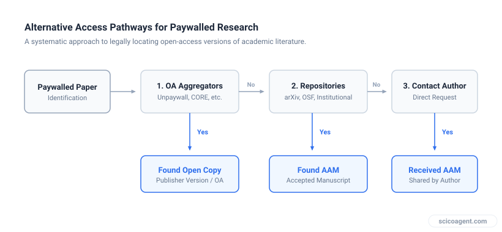
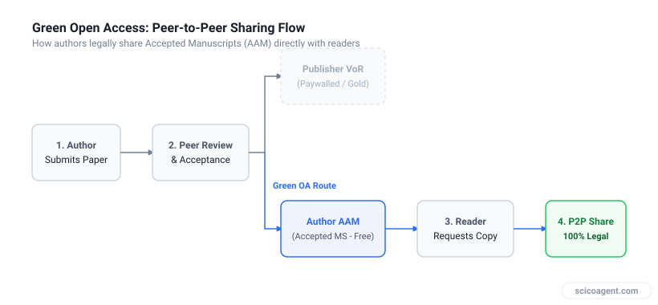

In brief
<ul style="margin:0;padding-left:20px;"><li style="margin:6px 0;line-height:1.5;">Institutional subscription gaps do not prevent access to peer-reviewed findings</li><li style="margin:6px 0;line-height:1.5;">Authors often retain the legal right to share their accepted manuscripts directly</li><li style="margin:6px 0;line-height:1.5;">Pre-print servers and open-access repositories host legal, peer-reviewed alternatives to publisher PDFs</li></ul>

## Navigating paywalls legally through institutional repositories, self-archiving mechanisms, and peer-to-peer scholarly sharing.

"I'm struggling to access some recently published research papers because my University doesn't have subscriptions to certain journals." This common frustration, voiced by researchers at underfunded institutions, highlights a growing friction in scientific infrastructure. When accessing recent research papers becomes a bottleneck, it stalls literature reviews, delays experimental design, and isolates researchers from the active frontier of their fields.

Fortunately, a paywall is not an absolute barrier to the underlying science. The publishing ecosystem operates on two distinct parallel tracks: the publisher's proprietary version of record and the author's peer-reviewed manuscript. Understanding this distinction is the key to legal, reliable access.

| Version Type | Definition | Legal Access Path | Formatting and Layout |
| :--- | :--- | :--- | :--- |
| Pre-print | Submitted manuscript before formal peer review | Public servers (arXiv, bioRxiv, ChemRxiv) | Author's raw layout |
| Author Accepted Manuscript (AAM) | Post-peer-review text, incorporating all corrections | Institutional repositories, personal request | Author's word processor format |
| Version of Record (VoR) | Final published PDF with layout, typesetting, and copyediting | Publisher website (subscription or gold OA) | Journal template and branding |

*Decision framework for retrieving academic papers legally without institutional subscriptions*

## The Mechanics of Accessing Recent Research Papers Legally

To find articles outside of institutional subscriptions, you must target the Author Accepted Manuscript (AAM). The AAM contains the exact peer-reviewed, accepted scientific content as the Version of Record (VoR), but lacks the publisher's final typesetting and layout. 

Under the "Green Open Access" policies of most major academic publishers, authors are legally permitted to self-archive their AAM in institutional repositories or disciplinary archives, occasionally after an embargo period. 

To locate these manuscripts systematically, researchers can employ three main channels:

### 1. Open-Access Aggregators and Indexes
Instead of searching general search engines, query databases that specifically index institutional repositories. Services like BASE (Bielefeld Academic Search Engine) and CORE harvest metadata from thousands of open repositories globally, exposing millions of free-to-read AAMs that are otherwise buried in university archives.

### 2. Browser Extensions for Automated Discovery
Several metadata-driven browser extensions query open databases in real time when you visit a paywalled journal page. These tools search for matching DOIs in open-access repositories, instantly delivering a link to the legal post-print or pre-print version if it exists.

### 3. Direct Peer-to-Peer Requests
If no archived version exists online, direct contact with the corresponding author remains a highly effective, legal route. Publishers almost universally allow authors to share their own work with individual peers for research purposes. 

*Mechanism of green open access and direct author sharing*

## Scope and Limitations of Alternative Access

While these legal workarounds are robust, they have distinct limitations that researchers must factor into their workflows:

* **The Embargo Gap:** Many journals impose embargoes ranging from 6 to 24 months before an author is legally allowed to make their AAM publicly available in a repository. For truly recent research papers, the green open-access version may not yet be public.
* **Formatting Discrepancies:** Because the AAM lacks the publisher's final typesetting, pagination will differ from the VoR. When citing specific pages or equations, you must cross-reference carefully.
* **Author Response Rates:** Relying on direct email requests introduces a human bottleneck. Corresponding authors may have changed institutions, or their email addresses may be inactive, leading to low response rates for older papers.

To make this practical, start by auditing your current search habits. Install a reputable open-access browser extension, and search BASE or CORE before assuming a paper is out of reach. If those fail, use a templated, polite email to request the AAM directly from the corresponding author, a request that most scientists are glad to fulfill.

## The Structural Reality of Open Access

We tend to view the subscription barrier as a restriction on reading the literature. However, as the scientific community successfully bypasses these reading paywalls through pre-prints and repositories, publishers are adjusting their business models. 

The true barrier is not disappearing; it is migrating. The rise of open-access mandates has shifted the financial gatekeeping from *reading* research to *publishing* it. When we route around the subscription wall using repositories, we reveal a deeper systemic asymmetry: researchers at underfunded institutions can now read the global scientific output, but they are increasingly priced out of contributing to it because of high article processing charges (APCs). The paywall has not been demolished, it has simply been turned inside out.
