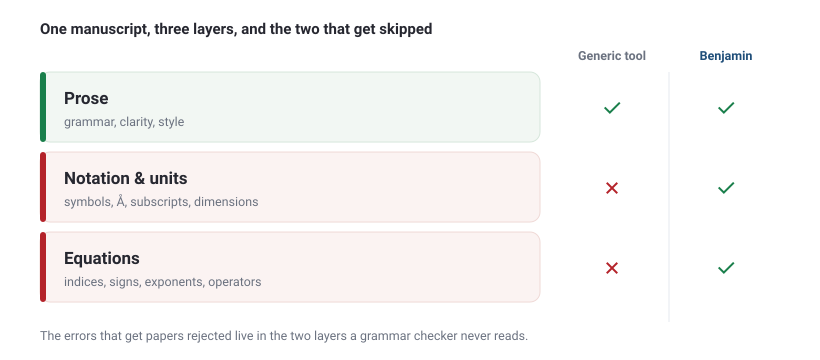

It is a little after two in the morning. You have read your own paper so many times that your eyes have stopped landing on the words, they just slide across them. You run it through the grammar checker one last time, watch the final underline vanish, see the small green checkmark that says everything is fine, and you submit.

Three weeks later a reviewer circles Equation 7.

Every tool you own had let it through, because none of them were reading the science. They were reading the spelling. That gap is the whole reason "proofread my LaTeX" is a different job from "proofread my email," and it is why most of the tools that promise to do it quietly avoid the hardest part.

This is a guide to what a real AI proofreader for LaTeX documents has to do, why the popular options stop short, and what it looks like when a proofreader actually reads your math. If you just want the tool, that is [Benjamin](/blog/latex-proofreader/). If you want to understand the problem first, read on.

## Why proofreading LaTeX is a different job

A LaTeX manuscript is three documents stacked on top of each other, and each one can be wrong in its own way.

- **The prose.** Ordinary English, where a grammar tool is genuinely useful.
- **The code.** `\begin{equation}`, `\cite{}`, `\label{}`, custom macros, the machinery that has to survive intact or the paper stops compiling.
- **The mathematics.** The symbols, indices, units and notation that carry the actual scientific claim.

A general grammar checker only knows how to read the first layer. Point it at a `.tex` file and it does one of two unhelpful things. It either treats your markup as text and "corrects" `\cite{Feynman1965}` into something that no longer compiles, or it is told to ignore anything that looks like code, at which point it skips your equations, your units and half your notation. Either way, the layer most likely to sink you at review is the layer it never read.

That layer matters more in science than anywhere else. A roman "d" where an italic $d$ belongs turns a derivative into a stray variable. Drop the little ring off an Å and a careful bond length becomes nonsense. Miss a diacritic and Veličković becomes some other author who never wrote the paper you are citing. We started calling these SciTypos, and they survive peer review for a plain reason: everyone in the chain, the authors, the reviewers, the copy-editor, the software, is quietly checking the same layer, the prose. Nobody is assigned to the math.

## What a real LaTeX proofreader has to check

If a proofreader is going to earn the word in a scientific setting, the checklist is longer than grammar.

1. **The code stays intact.** Commands, environments, labels, cross-references, citations and math delimiters come back untouched, and the file still compiles.
2. **Grammar in context.** The prose is proofread as a scientific manuscript, so terminology stays precise and consistent instead of being "simplified" into something wrong.
3. **Equation integrity.** The math is read for conceptual and formatting soundness: indices, signs, exponents, operators, the difference between a variable and the operator it is pretending to be.
4. **Units and dimensions.** Units are consistent and physically possible, and conversions carry the right powers.
5. **Notation consistency.** A symbol defined once means the same thing on page 12 as it did on page 2, and two different quantities do not quietly share one letter.
6. **Tracked, reversible edits.** Nothing is rewritten in secret. You see every change and accept or reject it.
7. **Language is not a barrier.** A non-native draft gets the same careful read as a native one.

Hold that list against what the popular tools actually do, and a pattern appears.

## The tell: everyone skips the equations

Here is the quiet admission buried in most LaTeX proofreading advice. To proofread the math "safely," you are told to remove it first.

One widely shared workflow tells you to replace every inline `$...$` with a placeholder like `[MATH1]`, exclude your display equations from the tool entirely, and paste the originals back when the tool is done. The commercial tools describe the same idea more gently: they "preserve the integrity of your LaTeX code," which is a careful way of saying they leave the math exactly as they found it, wrong exponent and all.

Read literally, the promise is: we will not break your equations. Which is true, and also beside the point, because they will not read them either. The one part of your paper a reviewer is most likely to reject is the one part these tools are built to step around.



## What it looks like to actually read the math

Let me make this concrete. Here is a short, entirely ordinary passage from a methods section, the kind that compiles cleanly and reads fine to a tired author at 2am.

```latex
The total interaction energy is
\begin{equation}
  E = \sum_{i \neq j} V(r_{ij}),
\end{equation}
where the pair potential decays with distance. Particles diffuse with
coefficient $D = 2.3 \times 10^{-9}\,\mathrm{m/s}$, and the thermal
scale is set by $k = 1.38 \times 10^{-23}\,\mathrm{J/K}$.
```

A grammar checker sees three clean sentences and moves on. Read as science, there are three separate errors, and none of them is a typo in the English.

**One: the sum double counts.** As written, the energy is

$$ E = \sum_{i \neq j} V(r_{ij}), $$

which adds every pair twice, once as $(i,j)$ and once as $(j,i)$. Unless you meant to double the energy of your whole system, the intended sum is over unordered pairs:

$$ E = \sum_{i < j} V(r_{ij}). $$

**Two: the diffusion coefficient has impossible units.** A diffusion coefficient measures area per time, not length per time. `m/s` is a velocity. The correct dimension is $\mathrm{m^2/s}$.

**Three: the notation is about to collide.** The thermal energy is set by the Boltzmann constant, which is conventionally $k_B$. Calling it $k$ here is fine for exactly as long as no rate constant, wave number or spring constant shows up later in the paper, at which point two different quantities are sharing one letter and the reader has to guess which is which.

Here is what comes back, as an inline diff you can read line by line:

```diff
- E = \sum_{i \neq j} V(r_{ij})
+ E = \sum_{i < j} V(r_{ij})          % pairs counted once, not twice

- D = 2.3 \times 10^{-9}\,\mathrm{m/s}
+ D = 2.3 \times 10^{-9}\,\mathrm{m^2/s}   % diffusion coefficient is area/time

- k = 1.38 \times 10^{-23}\,\mathrm{J/K}
+ k_B = 1.38 \times 10^{-23}\,\mathrm{J/K}  % Boltzmann constant, freeing k for later
```

No fireworks. Just the specific, slightly obsessive corrections a careful colleague would have made in the margin, before a stranger ever got the chance. That is the difference between proofreading around your equations and proofreading them.

## Context, not rules

There is a second thing the word proofreading has to mean in science, and it is easy to miss because the better tools already do half of it.

A rule engine flags patterns: a passive verb, a doubled word, a missing comma. A context-aware proofreader reads meaning instead. It knows that "significant" in a results section is a statistical claim and not a synonym for "large," that a term you defined on page 3 has to keep meaning the same thing on page 14, and that an epsilon sitting next to a set is probably trying to be an "element of" sign. Most modern AI proofreaders do this for your prose, which is why they earn the tick in the table below.

Benjamin's difference is that it carries context down into the science. It reads a symbol in the light of how you defined it, a unit in the light of the quantity it belongs to, and a piece of notation in the light of your field's conventions. That is why the units and notation rows end up filled for Benjamin alone. It is not that the others cannot read context, it is that their context stops at the language and his continues into the math.

## How the LaTeX proofreaders compare

Every claim below is drawn from each tool's own public description as of July 2026. Benjamin's row is what he is built to do.

<div class="cmp">

| What it checks | Generic grammar tools | Trinka | SciSpace | ProofreaderPro | **Benjamin** |
| --- | :---: | :---: | :---: | :---: | :---: |
| Leaves LaTeX code intact | ✗ | ✓ | ✓ | ✓ | ✓ |
| Proofreads the prose | ✓ | ✓ | ✓ | ✓ | ✓ |
| Context-aware proofreading | partial | ✓ | ✓ | ✓ | ✓ |
| Reads inside display equations | ✗ | partial | not documented | ✗ (removes them) | ✓ |
| Proofreads equations (checks the math is right) | ✗ | ✗ | ✗ | ✗ | ✓ |
| Units and dimensions | ✗ | ✗ | ✗ | ✗ | ✓ |
| Notation consistency | ✗ | ✗ | ✗ | ✗ | ✓ |
| Tracked changes | ✗ | ✓ (Word) | ✗ | ✓ | ✓ (Word or inline LaTeX diff) |
| Languages | 1 to a few | 7 | English-first | English-first | 95+ |

</div>

The honest summary: the dedicated tools have solved "do not break the file." The column that is still empty almost everywhere is the math, the units and the notation, which is exactly where scientific manuscripts fail. For the full head-to-head, see [the LaTeX proofreader comparison](/blog/posts/best-latex-proofreader-comparison/). For the workflow itself, see [how to proofread LaTeX without breaking your equations](/blog/posts/proofread-latex-without-breaking-equations/).

## Meet the proofreader who reads the science

[Benjamin](/blog/latex-proofreader/) is an AI proofreader built for LaTeX by scientists. He is named for Benjamin Franklin, a printer who caught the slips before a page reached the press and a scientist who understood what the type was trying to say, which is precisely the double vision a manuscript needs. He reads symbol by symbol: your units, your notation, your matrices, and the sign in front of every term. He works in the formats you already live in, so LaTeX, Word, plain text and RTF are all fine, in 95+ languages. And he hands the file back the way a good co-author would, as a clean copy plus tracked changes you can accept, argue with, or throw out one line at a time.

## The wrong half of the paper

So here is the thing worth sitting with. When your tool reports that your document is clean, ask which document it read.

If it read your prose, congratulations, your sentences are tidy. That is the half of the paper a reviewer skims. The half a reviewer actually stress-tests, the equations and the units and the notation, may be exactly as broken as it was before you ran anything, because the tool was designed to leave it alone.

A summation sign that slides under a fraction bar can flip the physics of an entire model with total confidence. That is not hypothetical. It sat in a heavily cited paper for years and, read literally, described [a universe that tears itself apart](/blog/posts/the-universe-eats-itself/). Every language checker in the world would have called that manuscript clean.

Proofreading your English while ignoring your math is not a lighter version of proofreading. It is proofreading the wrong half of the paper. The second pair of eyes you always wanted at two in the morning should be reading the half that gets you rejected, and unlike you, it never needs the weekend off.

Give [Benjamin](https://benjamin.scicoagent.com) your next manuscript before a reviewer does, and let him read the science, not just the spelling.
