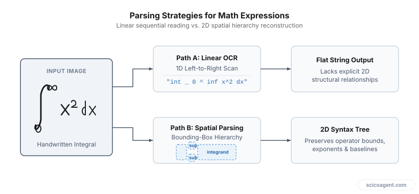
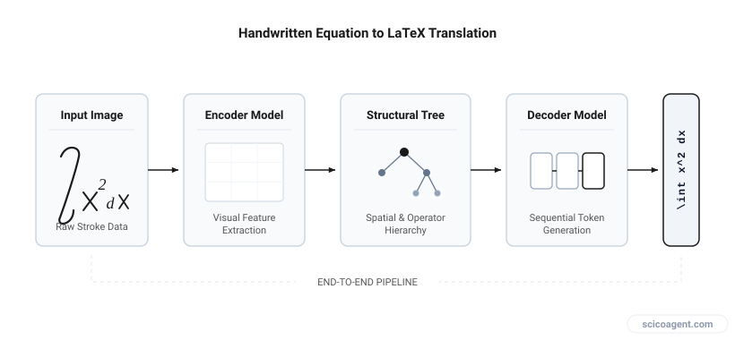

In brief
<ul style="margin:0;padding-left:20px;"><li style="margin:6px 0;line-height:1.5;">Optical character recognition models designed for standard text fail on mathematical equations due to two-dimensional spatial syntax and non-linear baseline arrangements.</li><li style="margin:6px 0;line-height:1.5;">Specialized math OCR tools parse visual layouts into abstract syntax trees before emitting LaTeX code, significantly reducing manual conversion effort.</li><li style="margin:6px 0;line-height:1.5;">Post-processing verification remains necessary because syntactically valid LaTeX can still misrepresent mathematical semantics like index positions and operator bounds.</li></ul>

### A technical look at spatial syntax parsing, optical character recognition, and converting complex equations without retyping.

How are you currently converting handwritten mathematical notes and blackboard derivations into clean, compilable LaTeX without spending hours retyping every symbol? 

For most mathematicians and STEM researchers, the draft phase of a paper still begins on paper, whiteboards, or digital tablets. Moving those derivations into a manuscript traditionally requires manual transcription. Retyping complex multi-line displays, nested fractions, and indexed matrix operations takes substantial time and introduces small transcription errors that are tedious to catch later.

Standard optical character recognition (OCR) tools handle linear text reasonably well, but they break down immediately when presented with mathematical notation. Understanding why standard tools fail, how specialized math OCR parsers reconstruct mathematical layout trees, and where manual verification remains essential can make digitizing research notes far more efficient.

## The Spatial Parsing Problem in Mathematical Notation

Standard text OCR operates on a single primary assumption: text flows linearly along a single horizontal baseline from left to right (or right to left). Characters are segmented as discrete sequential units along this baseline.

Mathematical notation explicitly violates this assumption. Equations rely on a two-dimensional spatial layout where relative position alters meaning. A character placed slightly above and to the right of another is a superscript or exponent; placed directly above, it might be a vector hat, dot derivative, or bar; placed directly below, it might define the lower limit of an integral or summation.

*Comparison of standard linear OCR reading order versus spatial layout parsing for nested mathematical structures.*

Because math notation uses spatial relationships to construct syntax, an OCR engine must perform structural analysis alongside character classification. It must measure spatial bounding boxes, calculate relative centers of mass, and evaluate baseline offsets to determine whether a symbol is a inline factor, a subscript, or a subscript within an exponent.

| Parsing Aspect | Standard Text OCR | Mathematical OCR |
| :--- | :--- | :--- |
| **Primary Dimension** | 1D linear sequence | 2D spatial spatial hierarchy |
| **Baseline Tracking** | Single continuous baseline | Multiple dynamic baselines (sub/superscripts, fractions) |
| **Symbol Disambiguation** | Lexicon and dictionary matching | Contextual spatial boundaries and operator precedence |
| **Target Output Format** | Plain text / UTF-8 characters | Structured syntax tree (LaTeX, MathML) |

## How Specialized Parsers Reconstruct LaTeX

To convert an image of a handwritten derivation into compilable LaTeX, modern specialized tools run a multi-stage process that separates visual segmentation from structural parsing.

1. **Symbol Segmentation and Classification:** The visual engine identifies isolated strokes and groups them into individual glyphs. Neural networks classify these glyphs, recognizing standard alphanumeric characters alongside mathematical symbols, Greek letters, and bracket pairs.
2. **Layout Tree Construction:** Instead of arranging symbols in a line, the engine constructs an Abstract Syntax Tree (AST) representing the spatial relationships between identified symbols. A fraction bar, for instance, splits the spatial domain into a numerator region above and a denominator region below.
3. **LaTeX Code Generation:** Once the syntax tree is built, a decoder traverses the nodes to emit corresponding LaTeX control sequences, automatically inserting curly braces for grouping, correct matrix environment tags, and appropriate command tokens like `\frac`, `\int`, or `\sum`.

*Process flow showing how image data transforms into a spatial syntax tree before emitting LaTeX code.*

When working with handwritten input, stroke ambiguities present a secondary challenge. A sloppy handwritten `v` can look identical to a square root symbol's tail or a Greek `\nu`. Spatial parsers use surrounding context to resolve these ambiguities. If a symbol extends horizontally over a block of variables, the parser assigns a higher probability to `\sqrt{}` than to an isolated character.

## Verification and Common Failure Modes

While specialized OCR tools drastically accelerate the conversion of handwritten derivations into digital drafts, direct visual inspection remains a critical step. Automatically generated LaTeX can compile successfully without warning while still misinterpreting the underlying mathematics.

Common points where automated visual parsers make mistakes include:

* **Index Level Confusion:** Distinguishing between a subscript of a subscript (`x_{i_j}`) and two adjacent subscripts (`x_{i,j}`) when handwriting size is inconsistent.
* **Variable vs. Text Distinction:** Differentiating between isolated multi-letter variable names and standard text, such as confusing an italicized product `d \cdot x` with a differential operator `dx`.
* **Delimiter Alignment:** Identifying whether an enclosing parenthesis was intended to cover an entire fraction height, requiring `\left(` and `\right)` auto-scaling commands.

Checking generated output against original notes ensures structural fidelity before deep editing begins.

We built Benjamin to proofread LaTeX and Word manuscripts for notation and unit consistency automatically.

It is natural to assume that the hardest part of digitizing handwritten math is training vision models to recognize poorly written symbols. Yet symbol classification is largely a solved engineering task. The true bottleneck in mathematical digitization is that notation itself is incomplete by design. 

In formal papers, notation relies on unwritten regional, disciplinary, and contextual conventions that no visual parser can deduce from the image alone. An omitted multiplication dot, an implied tensor contraction index, or a implicit summation over repeated indices are clear to a researcher in your subfield, but they are completely absent from the raw visual signal. Digitization tools convert spatial marks into syntax, but assigning precise mathematical meaning still requires the domain expertise of the reader.
