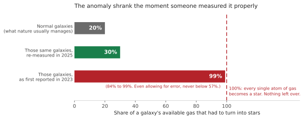
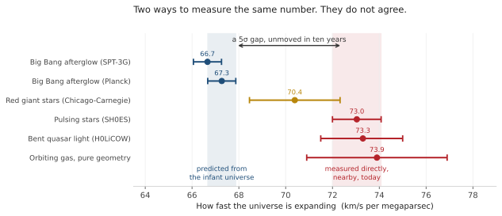

Two headlines keep getting told as one story. JWST found galaxies too big to exist that early. And our two ways of measuring how fast the universe is expanding stubbornly disagree. Conclusion, apparently: the textbooks are about to burn.

They are not one story. One of them is already dead. The other has survived ten years of people trying to kill it. And the result most likely to actually rewrite the textbook never made the headline.

## The galaxies that weren't

In 2023, six galaxies turned up looking impossibly grown-up: a Milky Way's worth of stars, assembled when the universe was 4% of its present age.

Here is why that frightened people, and it's the only way a galaxy can threaten a model of the universe at all. **A galaxy can't contain more stars than there was gas to build them.** Our model tells us how much gas each one had to work with. So you can ask a simple question: what share of that gas had to turn into stars?

Normal galaxies manage about 20%. The rest gets blown back out by exploding stars before it can collapse. Nature is wasteful.

Those six needed **84% to 99%**. Essentially every atom, nothing spilled. Stretch the error bars as far as they'll go and you still can't get them below 57%. That isn't a tight fit. That's a broken model.

Except the masses were wrong.

You can't count a galaxy's stars. You measure its colours and fit a model. And a galaxy's light is hogged by its rarest stars, the young hot bright ones that carry almost none of its mass. The stars that actually hold the mass are old, small, red and dim. These galaxies are so far away that the universe stretched their light ninefold on the journey here, which left JWST's main camera seeing only what began as blue light. **The stars that hold the mass were never in the data.** Those weights were a guess about light nobody had measured.

And some of those "galaxies" weren't galaxies. They were black holes, glowing furiously as they ate. Fit a feeding black hole with a model built for starlight and the model reports a mountain of stars that was never there.

In 2025, Tao Wang's team re-measured them using JWST's second camera, the one that sees redder light. The masses fell by a factor of 2.5. The count of massive galaxies dropped by up to 55%. Black holes masquerading as galaxies fell from 32% of the sample to 13%.

The required share of gas came down with them, to about **30%**.

*30% instead of 20% is not a crisis. It's a Tuesday.*

Thirty per cent is a real result. Early galaxies were denser, so gas collapsed faster than exploding stars could shove it away. That's interesting. It is not a broken universe. Another paper that year put it more bluntly in its title: *ΛCDM is still not broken.*

## The gap that won't close

Now the other headline. This one is real, and it's underhyped.

There are two honest ways to measure the expansion. **Measure it directly**, using stars whose true brightness we can work out as stepping stones outward. Or **predict it from the Big Bang's afterglow**, using a ripple of known size frozen into it.

Notice what the second one really is. It doesn't measure today. It measures the infant universe, then predicts today by assuming our model holds for the next 13.8 billion years. It's a prediction wearing a measurement's clothes.

Measured: 73.0. Predicted: 67.3. They don't overlap, and not by a little.

*Five sigma is the bar particle physicists set for announcing a discovery.*

People have been trying to kill this since 2016. *"Your stars are crowded together and just look bright."* JWST looked, and ruled that out at 7 to 8 sigma. *"We're sitting in an underdense bubble."* Not nearly big enough. *"It's one method's mistake."* No: bend a distant quasar's light around a galaxy and time the flickers, or use pure geometry on gas orbiting a black hole, and you still land at 73 to 74. Different physics, same answer.

One honest complication. Wendy Freedman's team uses different stars and gets 70.4, awkwardly in the middle. And the part I can't shake: their **distances** agree with everyone else's to about 1%. Same distances, different answer. So the disagreement has slid somewhere downstream, into how we calibrate exploding stars. Nobody has found it yet.

## The one nobody put in the headline

Our model assumes dark energy is a constant. Same strength, everywhere, forever. That's its most rigid assumption by far.

DESI has been mapping tens of millions of galaxies, and its data prefer dark energy that **weakens over time**, at 3.1 sigma. Add supernova data and you get somewhere between 2.8 and 4.2 sigma, depending which set you pick.

If it holds, that's the rewrite. Not a tweaked number but a deleted assumption. Then again, a significance that slides around based on which catalogue you bolt on is a result that hasn't finished being tested. Three-sigma results have a long, humbling history of evaporating.

## What actually separates them

Three anomalies. Identical "textbooks are wrong" energy. Wildly different standing.

The galaxies were **eight months old**, and nobody had run the obvious check. The tension is **ten years old**, and every boring explanation has been hunted down and shot. Dark energy is **new**, and it's being tested right now, in public.

Which is the whole point, and it travels to your field intact:

> **An anomaly's credibility has almost nothing to do with how surprising it is, and almost everything to do with what it has already survived.**

Surprise is cheap. Any new instrument produces a flood of it, and most of that flood is calibration, contamination, or selection. That's not a failure. It's what new instruments are for.

So the next time something breaks everything, don't ask whether it's surprising. Ask: How old is it? What's been tried against it, and actually tested rather than just mentioned? Do independent methods agree? And where would it break?

That last one matters most. For the galaxies it had a sharp answer: more than 100% of the gas. Not "these look big." **A claim that can name its own breaking point is doing science. One that can't is doing vibes.**

So, is the standard model breaking? Not the way the headline means. The invisible-matter half survived JWST comfortably, and it won on a longer wavelength rather than a cleverer argument. What's genuinely wobbling is dark energy.

That's not a textbook being torn up. It's a very good model being pushed, by patient measurement, to the exact edge where it stops working. That edge is where the next physics lives. It always has been.

The universe isn't breaking. We're just finally measuring well enough to see where our description of it does.

---

## Sources

- Labbé, I. et al. (2023). [A population of red candidate massive galaxies ~600 Myr after the Big Bang](https://www.nature.com/articles/s41586-023-05786-2). *Nature* **616**, 266. (The original six.)
- Boylan-Kolchin, M. (2023). [Stress testing ΛCDM with high-redshift galaxy candidates](https://www.nature.com/articles/s41550-023-01937-7). *Nature Astronomy* **7**, 731. (The gas requirement: "physically implausible values of ε(z≈9) = 0.99 and ε(z≈7.5) = 0.84," easing only to ≈0.57 once 1σ errors are allowed. Also the source for normal galaxies sitting at ε ≲ 0.2.)
- Wang, T. et al. (2025). [JWST/MIRI reveals the true number density of massive galaxies in the early Universe](https://arxiv.org/abs/2403.02399). *ApJL* **988**, L35. (The re-measurement: 2.5× lighter, 30%, and the 32% to 13% black-hole contamination.)
- Yung, L. Y. A., Somerville, R. S. & Iyer, K. G. (2025). [ΛCDM is still not broken](https://doi.org/10.1093/mnras/staf1699). *MNRAS* **543**, 3802.
- Prada, F. et al. (2023). [Confirmation of the standard cosmological model from red massive galaxies ~600 Myr after the Big Bang](https://arxiv.org/abs/2304.11911). (Predicted the whole thing early.)
- [The Hubble tension: A decade review](https://arxiv.org/abs/2606.20434) (2026). (The 5σ gap, the 7 to 8σ rejection of the crowding explanation, and every expansion-rate value plotted here except the 70.4.)
- Freedman, W. L. et al. (2025). [Status Report on the Chicago-Carnegie Hubble Program](https://arxiv.org/abs/2408.06153). *ApJ* **985**, 203. (The 70.39 ± 1.22 (stat) ± 1.33 (sys) ± 0.70 that sits in the middle, from the red-giant tip with 24 supernova calibrators.)
- DESI Collaboration (2025). [DESI DR2: BAO measurements and cosmological constraints](https://arxiv.org/abs/2503.14738). (Weakening dark energy, 3.1σ, and the 2.8 to 4.2σ range.)
