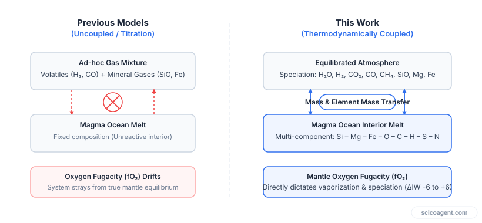
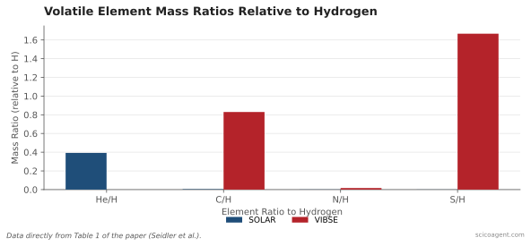

In brief
<ul style="margin:0;padding-left:20px;"><li style="margin:6px 0;line-height:1.5;">The oxygen fugacity of an exoplanet mantle acts as the primary control on infrared emission and transmission spectra.</li><li style="margin:6px 0;line-height:1.5;">Decoupled atmospheric models that inject volatile gases into pre-calculated mineral vapour produce unphysical estimates of oxygen fugacity and atmospheric mass.</li><li style="margin:6px 0;line-height:1.5;">Mid-Infrared Instrument observations from the James Webb Space Telescope rule out both high-metallicity Earth-like atmospheres and highly reduced solar-like atmospheres on 55 Cancri e.</li></ul>

How thermodynamic consistency resolves spectral degeneracies and connects exoplanet atmospheres to mantle oxidation states.

Coupled interior-atmosphere modeling of hot rocky exoplanets has emerged as an essential framework for interpreting data from space telescopes. Hot rocky exoplanets are ultra-short-period planets with dayside surface temperatures exceeding 1000 K, well above the melting point of silicates. Under intense stellar irradiation, these planets retain deep, long-lived magma oceans that actively exchange chemical species with the overlying gas layer. 

Recent spectra collected by the James Webb Space Telescope (JWST) hint at a volatile-rich atmosphere on the hot rocky exoplanet 55 Cancri e, potentially containing carbon monoxide or carbon dioxide. Because the timescales for chemical reactions at temperatures near 3000 K are exceptionally short, the atmosphere above a magma ocean should reach thermochemical equilibrium with the underlying melt. Consequently, the atmospheric composition recorded in emission and transmission spectra carries an imprint of the planet's interior geochemical state.

However, interpreting these spectral signatures requires models that handle chemical exchange without breaking the laws of thermodynamics.

## The Thermodynamic Paradox in Decoupled Models

Early attempts to model mixed mineral-volatile atmospheres on hot rocky planets used a two-step approach. Researchers calculated the evaporation of a dry silicate melt to determine the background pressures of mineral gases such as silicon monoxide, magnesium, and atomic iron. Afterwards, volatile gases such as hydrogen or carbon compounds were added to the system, and the final chemical equilibrium was calculated after the fact.

This sequential approach creates a fundamental thermodynamic inconsistency. When volatile elements like hydrogen and carbon are introduced into a mineral atmosphere, they consume free oxygen gas to produce molecules like water, carbon monoxide, and carbon dioxide. This oxygen consumption causes the oxygen fugacity of the combined system to drop significantly. 

*Previous models either injected mineral vapors into volatile backgrounds without accounting for oxygen fugacity (fO2) feedback, or tied fO2 directly to H2 gas titration. The new coupled model treats mantle fO2 as an independent variable controlling thermodynamic equilibrium between the magma ocean and the atmosphere.*

The partial pressures of evaporating mineral gases depend directly on oxygen fugacity. By determining the mineral gas pressures using an initial oxygen fugacity before volatile injection, the final equilibrium state ends up with a chemical potential that contradicts the starting assumption. 

Think of a massive marine aquarium buffered by a deep layer of crushed limestone. If you calculate how much limestone dissolves into pure distilled water, and then pour in a large volume of concentrated acid, you cannot assume the limestone evaporation rate remains fixed at its initial distilled-water value. The acid alters the chemical environment, which immediately shifts how the limestone dissolves. In a magma ocean atmosphere, the rocky mantle acts as an effectively infinite reservoir of oxygen, continuously resetting the chemical potential of oxygen across the interface.

## Principles of Coupled Interior-Atmosphere Modeling

To solve this inconsistency, Fabian Lukas Seidler and colleagues (2026) developed a fully coupled model structure using two integrated computational tools: `atmodeller` for interface chemistry and `phaethon` for vertical radiative transfer. 

Instead of treating gas injection as an arbitrary external addition, the coupled pipeline treats the oxygen fugacity of the molten mantle as an independent, controlling variable. The model enforces chemical potential equality between the melt phase and the gas phase simultaneously across the elements silicon, magnesium, iron, oxygen, carbon, hydrogen, sulfur, nitrogen, and helium:

$$\mu_{i, \text{melt}} = \mu_{i, \text{gas}}$$

Because the mantle is the dominant reservoir of oxygen, the oxygen fugacity is fixed by the interior redox state, expressed relative to the iron-wüstite (IW) buffer. Volatile elements partition between the liquid magma ocean and the gaseous atmosphere according to their specific solubility laws. Highly soluble species like water and sulfur-bearing gases dissolve extensively into the melt, whereas insoluble gases like helium remain almost entirely in the atmosphere.

To explore candidate planetary compositions, the study defined volatile chemistry along a mixing line between two primary endmembers: a solar gas composition and a composition representing the Volatile Inventory of Bulk Silicate Earth (VIBSE).

| Element Ratio | Solar Composition | VIBSE Composition |
| :--- | :--- | :--- |
| **He / H** | 0.392518 | 0.000000 |
| **C / H** | 0.004315 | 0.830000 |
| **N / H** | 0.001205 | 0.016700 |
| **S / H** | 0.000552 | 1.666700 |

By varying the mixing parameter between solar ($\gamma = 0$) and Earth-like ($\gamma = 1$) volatile ratios, alongside total volatile mass fractions ranging from 0.1 to 10 times Earth's budget, the coupled model establishes how interior conditions project into observable spectroscopic signals.

## Spectral Signatures Across Mantle Redox States

The coupled model demonstrates that mantle oxygen fugacity is the dominant factor governing both emission and transmission spectra of hot rocky exoplanets. As the oxidation state shifts from reducing to oxidizing conditions, the atmospheric chemistry undergoes distinct transitions:

1. **Highly Reduced Mantles ($\Delta\text{IW} < -3$):** Silicon monoxide (SiO) and carbon monoxide (CO) dominate both emission and transmission spectra. Evaporation of the silicate melt produces significant silicon monoxide gas, while hydrogen remains largely unoxidized.
2. **Intermediate Redox States ($-3 < \Delta\text{IW} < +3$):** Carbon monoxide (CO) and carbon dioxide ($\text{CO}_2$) dominate the infrared spectra. Water ($\text{H}_2\text{O}$) features appear across all atmospheres in this regime, though their strength depends on the total available hydrogen budget.
3. **Highly Oxidized Mantles ($\Delta\text{IW} \ge +3$):** In high-metallicity atmospheres, carbon dioxide ($\text{CO}_2$) is joined by sulfur dioxide ($\text{SO}_2$). Sulfur dioxide produces a strong, unmistakable absorption feature near $9\,\mu\text{m}$. Furthermore, cooling induced by triatomic gas molecules causes silicate and iron oxide species to condense in the upper atmosphere.

*The two compositional endmembers defined in the study's framework: primordial SOLAR gas (H-rich) versus Volatile-Informed Bulk Silicate Earth (VIBSE, enriched in C, N, and S relative to H).*

Applying this framework to 55 Cancri e, a planet with a mass of roughly 8 Earth masses and a radius of 1.74 Earth radii at the magma ocean boundary, provides strong constraints on its atmospheric structure. Combining mass-radius trends with spectral data shows that 55 Cancri e cannot support a high-metallicity Earth-like atmosphere or a highly reduced solar-like atmosphere under JWST Mid-Infrared Instrument (MIRI) observations. The MIRI spectral range directly covers the key $9\,\mu\text{m}$ sulfur dioxide feature and high-density carbon dioxide bands. Conversely, data from the Near Infrared Camera (NIRCam) alone remain inconclusive due to overlapping absorption bands at shorter wavelengths.

Observations at wavelengths beyond $8\,\mu\text{m}$ are therefore essential for resolving atmospheric composition and mantle oxidation states on rocky worlds.

## The Interior Reveal

Scientists frequently assume that observing an exoplanet atmosphere offers a direct inventory of the volatile gases delivered during planet formation. It is tempting to treat atmospheric spectra as a straightforward reflection of initial accretion ingredients.

However, the coupled interior-atmosphere model reveals a fundamental reversal: the atmosphere of a hot rocky exoplanet is not a pristine fossil of its origin. Because the molten mantle acts as an active chemical buffer, two planets born with vastly different volatile mass budgets and initial compositions can evolve to display identical atmospheric spectra if their mantle oxygen fugacities align. 

Conversely, a single initial volatile budget can yield entirely different atmospheric compositions, ranging from silicon-monoxide-rich reducing skies to sulfur-dioxide-dominated oxidizing skies, controlled entirely by the oxidation state of the underlying melt. The atmosphere of a lava planet is not merely a gas envelope, but a dynamic thermodynamic projection of the deep, unseen rock below.

## Sources
Fabian Lukas Seidler et al. (2026). Volatile-bearing mineral atmospheres of hot rocky exoplanets as probes of interior state and composition. Astronomy and Astrophysics. https://doi.org/10.1051/0004-6361/202557276
