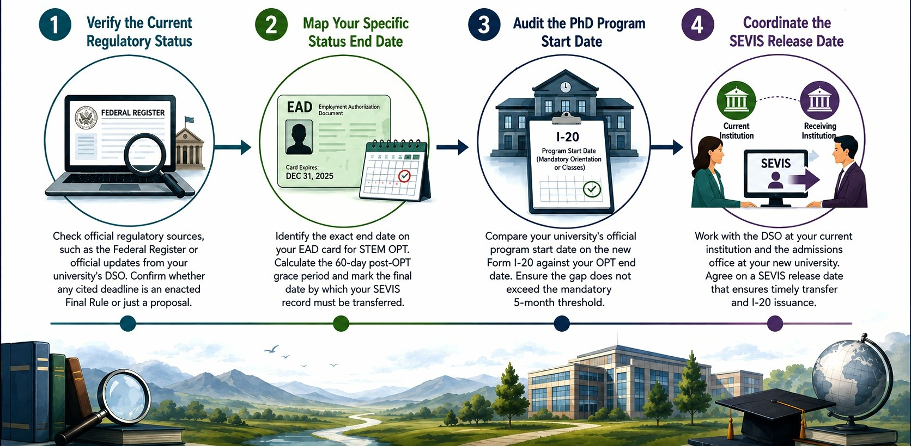

A practical guide to SEVIS transfer rules, regulatory timelines, and maintaining legal status between STEM OPT and graduate school.

For international researchers completing Optional Practical Training (OPT) or STEM OPT extensions, planning the transition into a doctoral program is both an academic milestones and a legal compliance task. Recent discussions across academic forums reflect widespread anxiety surrounding potential Department of Homeland Security (DHS) regulatory shifts, particularly proposed changes to Duration of Status (D/S) regulations. Many early-career researchers find themselves asking whether panic-enrolling into a PhD program before an arbitrary September deadline is necessary to protect their F-1 visa status.

Navigating immigration policy requires distinguishing between active federal regulations and proposed rulemakings. Making academic career decisions based on unfinalized administrative proposals can unintentionally compromise work authorization or disrupt research funding. By understanding the concrete regulatory mechanisms governing Student and Exchange Visitor Information System (SEVIS) transfers, you can maintain continuous legal status without rushing your academic enrollment timeline.

## Navigating DHS Rules: Proposed Regulations versus Active SEVIS Requirements

Much of the confusion regarding enrollment deadlines stems from proposed rulemakings published by DHS in past policy cycles, such as notices seeking to replace open-ended Duration of Status (D/S) with fixed terms of authorized stay. When news of proposed regulatory changes circulates through academic networks, researchers often mistake a Notice of Proposed Rulemaking (NPRM) for an active, enforceable policy.

An NPRM is a legal invitation for public comment, not an immediate change in immigration law. Before a proposed rule takes effect, the agency must review public comments, draft a final rule, clear executive review, and publish an official implementation date. Unless a final rule has been published with an effective start date, the existing regulations governing F-1 status remain fully active.

Under current regulatory standards, F-1 status is maintained by complying with active SEVIS reporting requirements, maintaining full-time enrollment or approved practical training authorization, and adhering to designated transition windows between programs. Panic-enrolling in a PhD program before September to evade rumored changes to DHS rules is unnecessary unless an officially enacted regulation specifically dictates that cutoff.

## The Core Mechanisms of F-1 Transitions: The 5-Month Rule and Grace Periods

Maintaining legal nonimmigrant status between completing STEM OPT and starting a PhD program relies on two primary statutory mechanisms: the 60-day grace period and the 5-month SEVIS transfer window.

When an F-1 student completes an OPT or STEM OPT period, federal regulations grant a 60-day grace period. During this window, you may lawfully remain in the United States while preparing for departure, changing visa categories, or transferring your SEVIS record to a new academic institution.

To maintain continuous F-1 status without leaving the United States, your SEVIS record must be transferred from your current school or OPT sponsor to your new university. This transfer must satisfy two clear timing criteria:

1. The SEVIS transfer release date must occur within 60 days of your OPT authorization end date.
2. The academic start date of your new PhD program must begin within 5 months of your OPT end date or the SEVIS release date, whichever is earlier.


If the gap between the end of your OPT and the start of your PhD program exceeds 5 months, current federal rules require you to leave the United States and re-enter using a new initial I-20 form closer to the program start date. 

## A Practical Workflow for Planning PhD Enrollment

To ensure your transition into a PhD program remains compliant without making premature academic commitments, follow this four-step evaluation workflow.



*A four-step workflow for STEM OPT to PhD Transition*

### Step 1: Verify the Current Regulatory Status
Check official regulatory sources, such as the Federal Register or official updates from your university's Designated School Official (DSO), rather than social media forums. Determine whether any cited deadline, such as a September rule change, represents an enacted Final Rule or merely a past or ongoing regulatory proposal.

### Step 2: Map Your Specific Status End Date
Identify the exact end date listed on your Employment Authorization Document (EAD) card for STEM OPT. Calculate the 60-day post-OPT grace period and mark the final date by which your SEVIS record must be transferred.

### Step 3: Audit the PhD Program Start Date
Compare your university's official program start date, usually listed as the first day of mandatory orientation or classes on the new Form I-20, against your OPT end date. Ensure that the gap does not exceed the mandatory 5-month threshold.

### Step 4: Coordinate the SEVIS Release Date
Work directly with the DSO at your current institution and the admissions office at your receiving university. Establish an explicit SEVIS release date that allows you to fulfill your remaining employment obligations while ensuring your new institution receives your record in time to issue an updated I-20.

## Managing the Intersection of OPT Employment and SEVIS Release

A vital mechanical detail that researchers often overlook is the immediate statutory impact of the SEVIS transfer release date on active work authorization.

Under current immigration regulations, the moment your SEVIS record is transferred to a new academic institution, any remaining OPT or STEM OPT work authorization instantly terminates. Even if your EAD card lists an expiration date months in the future, you can no longer lawfully work on STEM OPT once the transfer release date passes.

If you request an early SEVIS transfer in an attempt to enroll early or beat an unconfirmed regulatory deadline, you immediately surrender your right to continue paid employment under STEM OPT. This can result in an unexpected loss of income or premature disruption to ongoing laboratory research projects before your graduate stipend or assistantship official funding begins.

```
+-------------------------------------------------------------------+
|                  SEVIS Transfer Timeline Rules                    |
+-------------------------------------------------------------------+
| Requirement 1: SEVIS Release Date <= OPT End Date + 60 Days       |
| Requirement 2: PhD Class Start Date <= SEVIS Release Date + 5 Mos |
| Work Rule: OPT Work Authorization = ENDS ON SEVIS Release Date    |
+-------------------------------------------------------------------+
```

By systematically checking these constraints with your institutional DSO, you protect your legal standing while maintaining control over your academic career trajectory.

## The Real Risk in Rushing PhD Enrollment

When researchers fear shifting DHS rules, the intuitive reaction is often to accelerate enrollment timelines and secure a PhD placement as quickly as possible. However, understanding the administrative mechanisms of SEVIS reveals a counterintuitive truth.

Rushing to transfer your SEVIS record to an academic institution to beat an hypothetical deadline does not add legal protection; instead, it prematurely terminates your active STEM OPT employment authorization on the exact day the transfer takes effect. If there is a multi-month gap between that early transfer release date and the start of fall classes, you leave yourself without legal authorization to work, without active academic enrollment, and tied to an accelerated timeline that may compromise your choice of graduate programs. 

The primary compliance risk facing international researchers is rarely a sudden, unannounced regulatory shift in duration of status. The real risk is triggering an early SEVIS transfer that inadvertently cancels active work authorization and creates an unmanageable gap before doctoral study officially begins.
