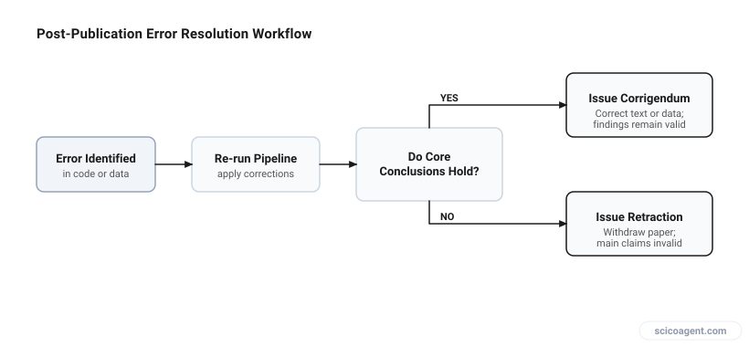
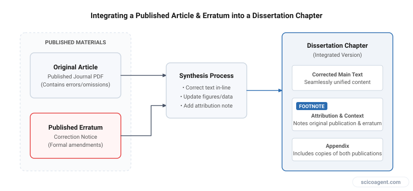

In brief
<ul style="margin:0;padding-left:20px;"><li style="margin:6px 0;line-height:1.5;">Conduct a three-tier severity audit immediately upon discovering an error to separate formatting slips from outcome-altering miscalculations.</li><li style="margin:6px 0;line-height:1.5;">Contact journal editors with a clear erratum proposal before your defense to establish a formal record of transparent self-correction.</li><li style="margin:6px 0;line-height:1.5;">Update your dissertation manuscript by explicitly documenting the original finding, the mechanism of error, and the corrected analysis.</li></ul>

## A systematic protocol for evaluating, reporting, and correcting errors in published research without derailing your dissertation defense.

Discovering a calculation error in your published research while writing your dissertation is a stressful moment, but it is a manageable problem with a clear protocol. Many graduate students encounter mathematical, computational, or typographical mistakes when re-analyzing raw data for their final thesis. The primary fear is that an error will invalidate a published paper, trigger allegations of misconduct, or jeopardize an upcoming dissertation defense.

Scientific record integrity depends on self-correction. Mistakes happen across all peer-reviewed literature. The distinction between a standard error and scientific misconduct comes down to intent, disclosure, and deliberate action. This guide outlines the exact steps to audit the mistake, contact journal editors, update your thesis, and present the corrected findings to your defense committee.

## Step 1: Conduct a Three-Tier Severity Audit

Before taking action, you must precisely isolate the error and assess its impact on your findings. Do not rely on initial panic. Re-run your scripts, re-check your derivations, and document the discrepancy in a dedicated lab notebook entry.

Errors generally fall into three distinct tiers:

| Error Tier | Description | Impact on Claims | Required Action |
|---|---|---|---|
| Tier 1: Minor / Formatting | Typos in unit labels, missing references, or minor notation inconsistencies. | None. Main conclusions remain fully valid. | Minor Erratum / Corrigendum or note in thesis. |
| Tier 2: Localized Calculation | Code indexing error or sign slip affecting specific numerical values. | Minor shift in figures, but core qualitative trends hold. | Formal Corrigendum with updated figures. |
| Tier 3: Structural / Fatal | Fundamental error in mathematical proof or dataset filtering that invalidates core results. | Primary conclusions are no longer supported. | Formal journal retraction and re-analysis. |

*Error evaluation and journal notification pathway*

## Step 2: Initiate the Journal Correction Process

Once you have classified the error, you must notify your co-authors and principal investigator. Present the original code or calculation alongside the corrected version. Show clearly where the divergence occurred.

If the error falls under Tier 1 or Tier 2, draft a formal Corrigendum for the journal editor. A Corrigendum is an official notice published by the authors to correct errors that do not invalidate the overall results of the paper.

Your communication to the editor should include:

1. The exact location of the error, including page number, equation number, figure, or table.
2. The precise nature of the calculation slip.
3. The corrected mathematical expression, figure, or dataset.
4. An explicit statement confirming that the primary conclusions of the study remain intact.

If the error falls under Tier 3, a Retraction is required. Retracting a paper when an underlying calculation invalidates the conclusions is appropriate scientific behavior. It preserves your reputation and prevents downstream researchers from building on flawed findings.

## Step 3: Integrating the Correction into Your Dissertation

A dissertation is an independent academic record. It does not need to mirror a published paper line for line if that paper contains a known mistake.

Instead of hiding the corrected analysis in a footnote, treat the error with explicit scientific transparency:

- Include a dedicated note or appendix in the relevant chapter stating that an erratum has been submitted to the original journal.
- Present the corrected calculation and updated figures directly within the main text of the chapter.
- Provide a brief commentary explaining the mathematical mechanism of the error and how the corrected data alters or confirms your interpretation.

*Structure for integrating corrected published work into a dissertation*

## A Worked Mini-Example

Consider a study measuring signal attenuation across a set of experimental samples. During dissertation compilation, the author notices a scripting error: a base-10 logarithm was used in the calibration script where a natural logarithm was required.

- Impact: All calculated attenuation coefficients were shifted by a constant multiplier of approximately 2.303.
- Assessment: The absolute magnitude of the attenuation values was incorrect, but the relative differences between treatment groups and the statistical significance levels remained completely unchanged.
- Outcome: The author submitted a Corrigendum to the journal with recalculated absolute values. In the dissertation, the author updated the main figures, noted the logarithmic conversion oversight, and explained why the relative trends held true. The committee commended the candidate for catching the mistake.

## Preparing for Your Defense

Your defense committee evaluates your competence as an independent researcher, not your perfection. Attempting to conceal an error that you have discovered creates substantial professional vulnerability.

When presenting your work during your defense:

- Dedicate a slide in your presentation to the correction if it impacts core data figures.
- State clearly how the oversight occurred, how you identified it, and what actions you took to correct the public record.
- Frame the correction as a demonstration of technical rigor and compliance with publication ethics.

To automate some of these painful parts in academic proofreading, we built [Benjamin](https://benjamin.scicoagent.com/). It checks scientific units, notations, and equations in native manuscript formats to catch these mathematical slips before publication.

Graduate students often view a dissertation defense as an exam where any admitted flaw leads to failure. However, science progresses precisely through the identification and correction of errors. Discovering a flaw in your own published work and taking systematic steps to correct it demonstrates the exact quality a defense committee seeks to verify. It proves you have developed the critical distance required to evaluate data objectively, even when that data is your own. The candidate who uncovers and corrects their own mistake has not failed a test of competence; they have demonstrated the defining characteristic of a mature scientist.
