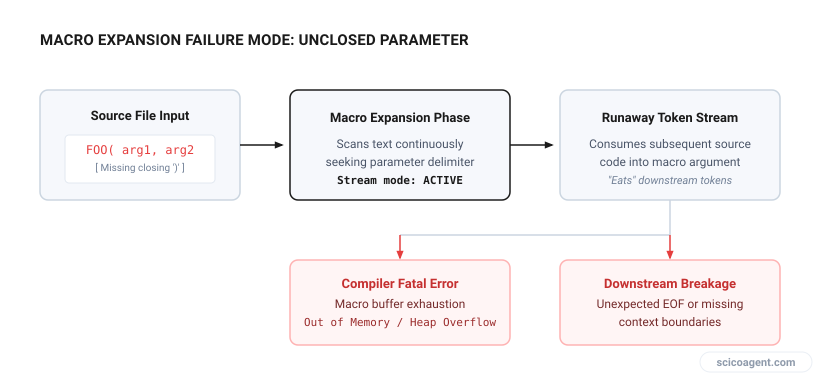
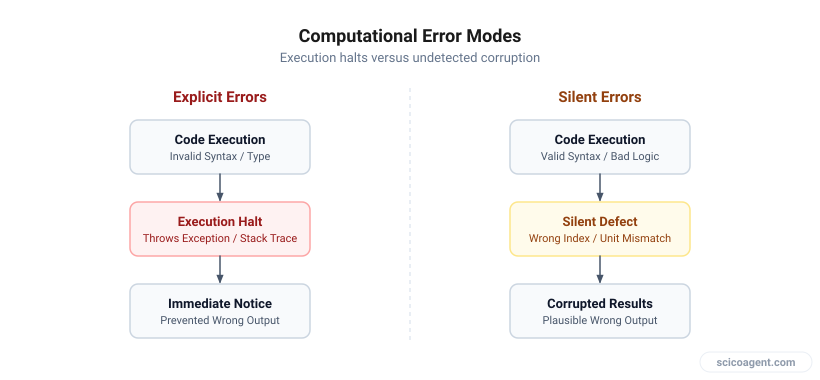

In brief
<ul style="margin:0;padding-left:20px;"><li style="margin:6px 0;line-height:1.5;">TeX compiler errors stem from macro expansion context rather than traditional imperative syntax rules</li><li style="margin:6px 0;line-height:1.5;">Binary search isolation in raw document blocks identifies missing delimiters and package conflicts in seconds</li><li style="margin:6px 0;line-height:1.5;">The most dangerous LaTeX errors do not halt compilation, but silently alter mathematical semantics</li></ul>

Understanding TeX engine expansion mechanics to debug document crashes and prevent silent semantic corruption.

Anyone who has written a scientific manuscript in LaTeX knows the specific frustration of a broken compilation run. You change two sentences in the discussion section, hit compile, and are immediately met with an unhelpful error message like `! Emergency stop` or `! Paragraph ended before \multispan was complete`.

The technical friction of debugging LaTeX compilation errors interrupts the flow of scientific writing and creates unnecessary administrative overhead. When you are trying to finalize a draft for submission, spending forty minutes hunting through a log file for an unclosed environment feels like a waste of research time.

To fix LaTeX compilation errors efficiently, it helps to understand why the TeX engine reports errors so cryptically in the first place.

## Why TeX Errors Feel So Cryptic

Unlike modern compiled languages like C++ or Rust, or interpreted languages like Python, TeX is an macro expansion engine designed in the late 1970s. It does not parse your document into an abstract syntax tree before execution. Instead, it reads token by token, expanding macros sequentially as it streams text into paragraphs and pages.

When an error occurs, TeX reports where it noticed something was wrong, which is frequently dozens of lines downstream from where you actually typed the mistake.

*How local source errors propagate downstream during macro expansion.*

For example, if you forget a closing brace inside a macro parameter, TeX will continue consuming tokens across paragraph breaks, through other macros, and into package files until it hits an explicit boundary that forbids new paragraphs. The error is thrown at the boundary, not at the missing brace.

## A Systematic Strategy for Isolate Compilation Errors

When a LaTeX document fails to build, relying on editor line numbers often leads to dead ends because the compiler log points to an internal sty file rather than your `.tex` source file. A structured diagnostic workflow eliminates the guesswork.

### 1. Read the Log from the Top Down
Editors often display only the final error line, which is usually a generic callout like `Fatal error occurred, no output PDF file produced!`. Scroll to the very first exclamation mark (`!`) in the output log. The lines immediately following the first exclamation point contain the precise token TeX was attempting to expand when execution failed.

### 2. Isolate Using Binary Search
If the line number in the log does not match the actual mistake, use a binary search approach directly in your source document. Insert `\end{document}` roughly halfway through your main text file. 

*   If the document compiles without error, the bug lies in the second half of the text.
*   If compilation still fails, the bug lives in the first half or in the preamble.

Move the `\end{document}` command forward or backward by half intervals. Within four or five iterations, you can narrow a thousand-line manuscript down to a five-line block.

### 3. Clear Intermediate Auxiliary Files
TeX caches internal states across multiple runs using auxiliary files like `.aux`, `.bbl`, `.toc`, and `.out`. If a previous compilation run crashed midway through writing a reference entry to the `.aux` file, subsequent compilation attempts will fail even after you fix the original source code. Delete all generated auxiliary files and run `pdflatex` or `lualatex` from a clean slate.

| Error Message | Common Structural Cause | Recommended Isolation Method |
| :--- | :--- | :--- |
| `! Missing } inserted` | Unclosed grouping or math mode block spanning across paragraphs | Insert `\end{document}` before the suspected section to confirm scope |
| `! File ended while scanning use of \macro` | Missing closing brace in a macro argument | Audit recent additions to custom command calls or table environments |
| `! Undefined control sequence` | Typo in macro name or missing `\usepackage{}` statement | Check log line directly below the error line to see where expansion stopped |
| `! LaTeX Error: Environment X undefined` | Package loaded after environment invocation or typo in `\begin{}` | Inspect preamble load order and package imports |

## Managing Manuscript Overhead

When working under strict conference or journal deadlines, manual syntax debugging degrades cognitive focus. Systematic diagnostic protocols keep the document structure clean, allowing researchers to concentrate on clear reasoning rather than macro parsing.

We built [Benjamin](https://benjamin.scicoagent.com) to perform manuscript proofreading and notation checking directly inside raw LaTeX files.

Beyond explicit compilation crashes, maintaining clean source files requires continuous attention to structural integrity. However, resolving compiler errors is only half the battle.

*Explicit compilation crashes compared to silent semantic errors in published papers.*

## The Silent Hazards That Compilers Miss

When a LaTeX file crashes, the compiler forces you to stop and fix it. The error is annoying, but it is safe: a document that fails to compile cannot accidentally end up in print with missing text.

The genuine hazard in scientific LaTeX writing is not the code that fails to compile, but the code that compiles cleanly while silently altering your scientific meaning.

Consider three common cases where TeX engines complete without throwing a single warning:

1.  **Unescaped Symbols in Text Mode:** Typing an unescaped percentage sign (`%`) inside a table cell does not trigger a error; it silently turns everything after it on that line into a comment, dropping data from your table entirely.
2.  **Subscript Grouping Mistakes:** Writing `$A_i,j$` produces $A_i,j$ where only the index $i$ is subscripted. To subscript both indices, TeX requires explicit grouping braces: `$A_{i,j}$`. Both commands are syntactically valid LaTeX, but they convey completely different mathematical relationships.
3.  **Operator Font Inconsistencies:** Typing `$\text{sin}(x)$` or `$sin(x)$` rather than `\sin(x)` results in $s \cdot i \cdot n \cdot x$ treated as four individual variables multiplied together in standard math italics, rather than a single trigonometric function.

When we focus entirely on making the LaTeX compiler happy, we risk developing a false sense of security. A clean compilation log simply means your source document satisfied TeX macro expansion rules. It offers no guarantee that your mathematical notation, unit dimensions, or physical variables match what you intended to communicate.

Debugging compiler errors protects your software workflow, but auditing clean output protects your science. The goal of manuscript preparation is never just to generate a PDF, but to ensure that the logical structure on the page matches the underlying mechanics of your research.
