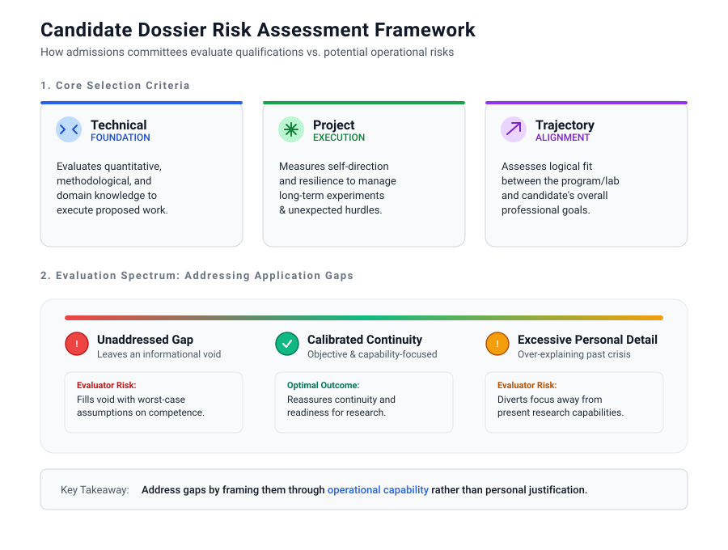
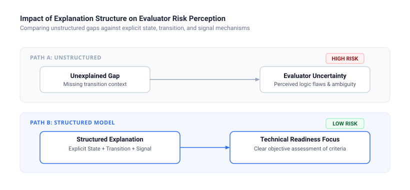
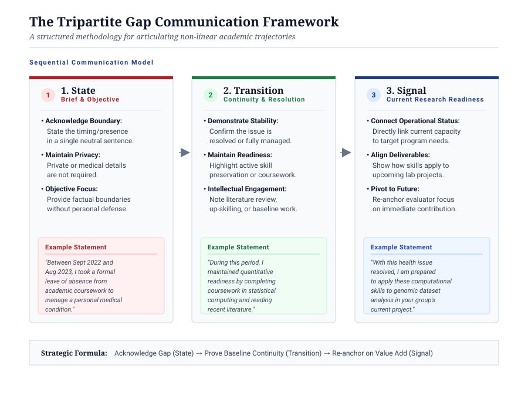

### How to translate non-traditional trajectories, medical leaves, and career breaks into clear, risk-mitigated signals of research readiness.

A researcher preparing graduate school applications recently asked a common question on an academic forum: how should one address a significant educational gap caused by personal hardship without framing the application as a failure? Around the same time, a doctoral candidate preparing for a re-joining interview after taking leave during a difficult program sought guidance on how to approach their principal investigator regarding their return.

These anxieties stem from a persistent belief in academic culture that research training must follow an unbroken sequence from undergraduate study to a doctoral degree and beyond. In practice, interruptions occur frequently across all scientific disciplines. Illness, family care obligations, industry shifts, and severe burnout disrupt trajectories far more often than formal CVs suggest.

The primary hurdle in addressing an educational gap is not the existence of the break itself. The hurdle is the ambiguity it introduces to evaluators who are trained to analyze risk, feasibility, and candidate readiness. By applying a structured, evidence-based approach to your personal statement and interviews, you can address gaps objectively while establishing your readiness for rigorous research.

## How Evaluators Assess Academic Discontinuities

Admissions committees and principal investigators review candidate dossiers through a specific analytical lens. When an evaluator encounters an unexplained multi-month or multi-year gap in an application, their primary concern is rarely personal judgment. Instead, they conduct a professional risk assessment regarding research continuity, program completion, and operational capability.

Selection committees evaluate candidates against three core operational criteria:

1. **Technical Foundation:** Does the candidate possess the quantitative, methodological, and domain knowledge required to execute the proposed work?
2. **Project Execution:** Does the candidate demonstrate the self-direction and resilience necessary to manage long-term experiments and unexpected technical hurdles?
3. **Trajectory Alignment:** Does this specific program or laboratory fit logically into the candidate's current professional goals?

When an educational gap is left completely unaddressed, evaluators often fill the informational void with worst-case assumptions regarding motivation or baseline competence. Conversely, when an applicant provides excessive personal detail about a past crisis, it can unintentionally draw focus away from their present research capability.

*Framework for transforming academic gap perceptions in selection processes.*

The objective of your application or interview is to provide enough clear, objective context to eliminate ambiguity, while rapidly steering the evaluation back to your research readiness.

## The Tripartite Framework for Addressing Gaps

To communicate a non-linear path effectively, you can employ a simple tripartite framework: **State**, **Transition**, and **Signal**.

### 1. State (Brief and Objective)
Acknowledge the timing and presence of the gap in a single, neutral sentence. You do not owe an evaluator private medical or personal details. Provide only the factual boundary of the event.

* Example statement: "Between September 2022 and August 2023, I took a formal leave of absence from academic coursework to manage a personal medical condition."

### 2. Transition (Stabilization and Continuity)
Demonstrate that the underlying issue is resolved or effectively managed, and mention any activities that maintained your academic baseline, such as literature review, skill development, or professional work.

* Example statement: "During this period, I maintained quantitative readiness by completing coursework in statistical computing and familiarizing myself with recent literature in computational biology."

### 3. Signal (Current Research Readiness)
Connect your current operational status directly to the targeted program or laboratory project. Show how your present trajectory aligns with the required technical deliverables.

* Example statement: "With this health issue fully resolved, I am prepared to apply these computational skills to the genomic dataset analysis outlined in your research group's current project."

## Worked Example: Framing Re-Entry After Burnout

Consider a doctoral candidate who stepped away from a lab due to severe burnout and is now preparing for a re-joining interview with their principal investigator.

A common mistake in this scenario is focusing entirely on past emotional state:
* Weak approach: "I suffered from severe burnout because the lab workload was unsustainable, but I feel much better now and want to try again."

This framing leaves the principal investigator questioning whether the candidate can handle the operational demands of the lab. Instead, apply the tripartite framework to shift the focus to systems, management, and project deliverables:

* Structured approach: "When I took leave, my workload balance had reached a point that compromised both my health and my research output. Over the past year, I worked to build sustainable time-management strategies and research workflows. I have reviewed our lab's recent publications, updated my literature notes on the protocol, and drafted a clear milestone schedule for the remaining experiments. I am fully prepared to meet these project deliverables."

This response acknowledges the historical cause, demonstrates active resolution, and directs the conversation toward measurable outcomes.

## Reframing the Non-Linear Path

When candidates prepare their materials, they often treat an academic gap as a flaw that must be excused or counterbalanced by exceptional performance. They assume evaluators prefer an candidate who has moved smoothly through every academic stage without pause.

However, observing selection processes reveals a different reality. 

Faculty members regularly observe candidates with perfectly linear trajectories encounter severe research failure for the first time during a doctoral program or postdoctoral fellowship. Without prior experience navigating disruption, these candidates often struggle to adapt, self-correct, or manage the accompanying stress.

An academic gap that has been successfully navigated and structured provides concrete evidence of risk management. When presented objectively, a non-linear trajectory demonstrates that a candidate possesses self-regulation, adaptability, and the capacity to resume complex work after a crisis. Far from being a liability, a properly framed gap signals to evaluators that you are an operational risk they can accurately assess and trust.
