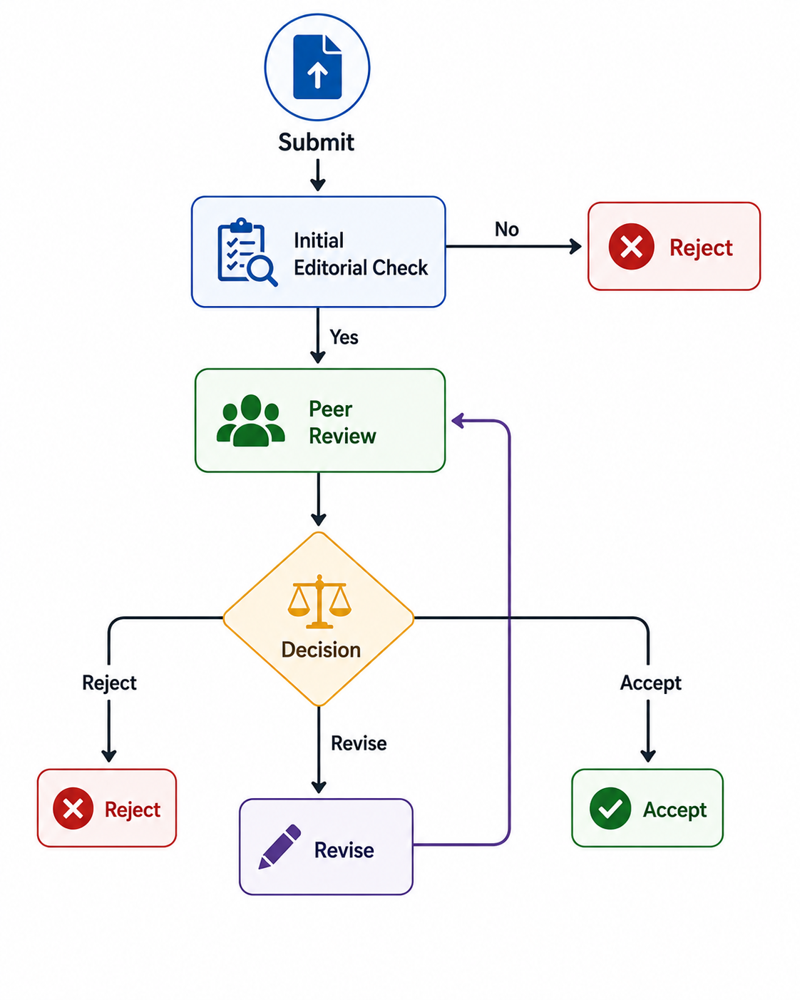
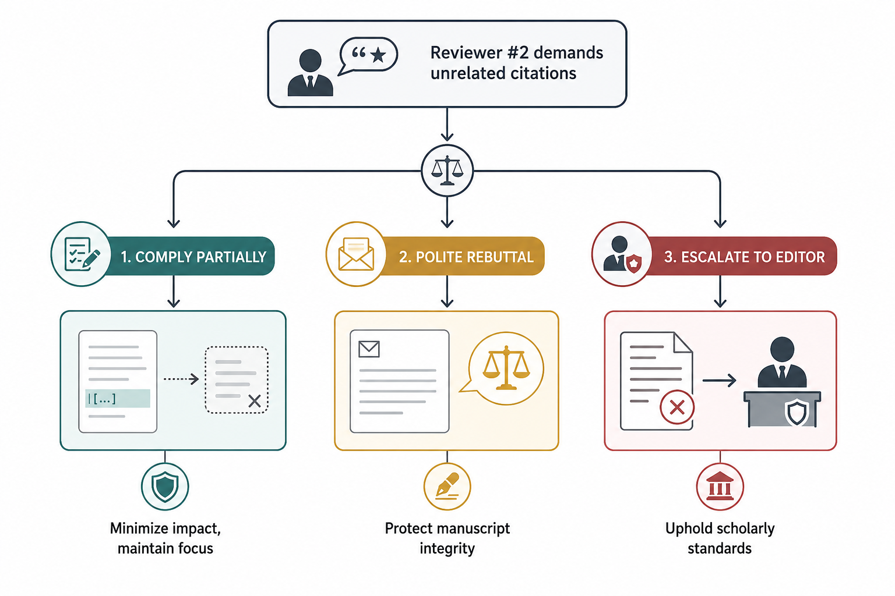

Academic publishing is ostensibly a meritocratic gatekeeper for scientific truth, but in practice, researchers frequently encounter opaque editorial processes and reviewers who prioritize their own agendas over the rigor of the work. When you receive a desk rejection for a study you believe is robust, or when a reviewer requests seven citations for their own unrelated work, the instinct is to take it personally. However, viewing these hurdles through the lens of human psychology and editorial constraints is more productive than viewing them as a reflection of your work's quality.

## Understanding the Editorial Desk Rejection

A desk rejection is rarely a detailed critique of your methodology. It is primarily an editorial triage decision based on fit, perceived novelty, or current journal capacity. Editors operate under intense pressure to maintain high impact factors and manage backlogs. When a manuscript hits their desk, they are often looking for reasons to say no to save their own reviewers from the labor of evaluating a paper that may not align with the journal's strategic scope.

If you are desk-rejected, resist the urge to resubmit blindly. First, evaluate whether the rejection letter offers a reason. If it is a generic template, it is a signal that the journal's current priority does not include your topic, regardless of your data quality. If the rejection suggests a lack of novelty, you must assess whether your abstract and introduction clearly articulate the advancement beyond existing literature. The goal is not to force the paper through but to identify whether the framing failed to reach the threshold of the journal's specific audience.

*The peer-review journey of a research paper.*

## Responding to Coerced Citations

Reviewer #2 demanding you cite their unrelated work is a common form of academic rent-seeking. This is not a request for academic enrichment; it is a tactic to artificially inflate citation metrics. When you encounter this, you have three primary paths, each with different risks.

First, you can comply partially, citing only the work that is tangentially relevant to appease the reviewer without bloating your bibliography. 

Second, you can write a polite rebuttal to the editor. Frame the response around the integrity of the manuscript rather than the behavior of the reviewer. For example, state that you have reviewed the suggested literature and determined that the existing references already provide the most direct support for your findings, noting that adding the requested citations would dilute the focus of the discussion.

*Three strategies to tackle unrelated citation demands*

Third, if the demand is egregious or central to the reviewer’s rejection, you must involve the handling editor. Provide evidence that the requested citations are not substantively related to your research questions. Editors are often unaware of the specific review history of their sub-editors or volunteer reviewers; by providing a professional, evidence-based account, you position yourself as a guardian of the journal's scholarly standard.

## The Mechanism of Reviewer Bias

The scientific community relies on the assumption that peer review is a neutral filter. Yet, review behavior is governed by the same biases that affect any human judgment. Confirmation bias leads reviewers to favor papers that align with their existing worldview, while the scarcity of qualified reviewers creates a power imbalance.

When you receive feedback that feels unfair, separate the critique into two buckets: factual errors regarding your data or methods, and subjective opinions regarding the "importance" or "novelty" of the work. You can and should fight factual errors with data and citations. Subjective opinions, however, are often immovable. Engaging with them as if they are objective truths is a losing battle. Instead, acknowledge the feedback without conceding the point, showing the editor that you have considered the perspective while maintaining the focus on your own findings.

The most effective researchers treat the peer-review process as a negotiation, not an examination. By stripping the emotional weight from the interaction, you can respond to reviewers as if they are simply another set of variables to manage in your workflow.

The irony of the current academic publishing crisis is that the gatekeepers are often as trapped as the submitters. We tend to view the editorial process as a high-minded pursuit of objective quality, assuming that if our science is sound, it will eventually be recognized. In reality, the entire system is built on the labor of the very people it rejects, meaning the "authority" of a publication is often just a lagging indicator of a consensus that was formed behind closed doors long before the manuscript was even submitted.
