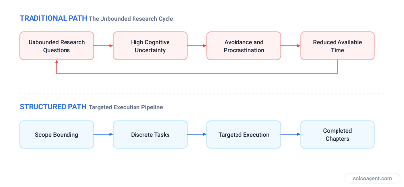
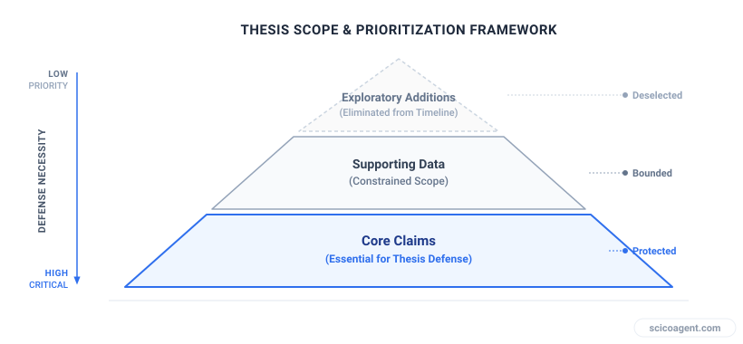
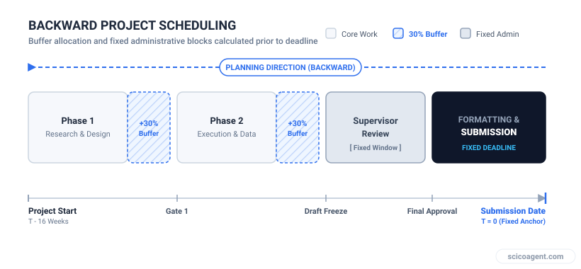

In brief
<ul style="margin:0;padding-left:20px;"><li style="margin:6px 0;line-height:1.5;">Late stage PhD procrastination is typically driven by task uncertainty and unbounded scientific claims rather than a lack of discipline.</li><li style="margin:6px 0;line-height:1.5;">Converting an infinite research project into a Minimum Viable Thesis requires auditing experiments by critical path relevance rather than theoretical completeness.</li><li style="margin:6px 0;line-height:1.5;">Backward scheduling with explicit uncertainty buffers prevents compounding delays when experimental protocols fail.</li></ul>

A systematic guide for late stage doctoral researchers facing paralysis, anxiety, and supervisor intervention to audit research scope and reach submission.

## The Mechanics of Late Stage Thesis Paralysis

When a doctoral student in their final year receives notification from a supervisor that they may not finish on time, the psychological impact can be severe. Entering the late stage of a doctorate with incomplete chapters, unresolved experimental protocols, and mounting anxiety often leads to behavioral paralysis. Researchers find themselves trapped in an avoidance cycle where the fear of missing the submission deadline produces acute stress, stress triggers procrastination, and procrastination further reduces the remaining time available to do the work.

Standard time management advice, such as working longer hours or applying rigid productivity techniques, frequently fails in an academic research environment. Scientific research carries inherent unpredictability. An experimental run can fail, a dataset can prove inconclusive, or an analytical model can fail to converge. When uncertainty is high, attempting to compensate by applying brute force effort increases cognitive fatigue and accelerates academic burnout.

To escape this cycle, you must treat your PhD timeline as a structural project management problem involving scope, resources, and risk mitigation rather than a personal failure of discipline or intelligence.

*The mechanics of research paralysis and how bounding scope breaks the avoidance loop.*

## Auditing Thesis Scope to Build a Minimum Viable Thesis

The primary reason late stage doctoral candidates stall is that they maintain an open ended definition of their final dissertation. In the early years of a PhD, exploring secondary research questions and unexpected data anomalies is valuable. In the final year, unconstrained scope creates terminal risk for your deadline.

To execute effective PhD timeline management, you must define your Minimum Viable Thesis (MVT). An MVT is the smallest defendable body of empirical and theoretical work that satisfies your institution's degree requirements and logically answers your primary research question.

To construct an MVT, conduct an audit of all remaining research tasks using a three level classification model:

| Task Category | Definition | Required Action |
| :--- | :--- | :--- |
| **Core Critical Path** | Experiments or analyses without which the primary research claim completely fails. | Prioritize daily. Freeze experimental protocols to prevent scope expansion. |
| **Supporting Claims** | Secondary data that strengthens the main argument but is not essential for logical coherence. | Cap total time allocated. Accept non-ideal but publishable scientific rigor. |
| **Exploratory Scope** | Tangential experiments, optimal parameter tuning, or extra sub-studies planned to make the thesis impressive. | Eliminate immediately. Relegate these ideas to the future work section. |

*Structuring thesis requirements into core, supporting, and disposable categories to protect final deadlines.*

## Backward Scheduling with Variance Buffers

Forward scheduling assumes that every research task will run according to initial estimates. In laboratory and computational research, this assumption is regularly disproved by technical delays and protocol troubleshooting. To establish a realistic schedule, you must construct your plan backward from your absolute submission deadline.

Begin by fixing non-negotiable institutional dates. These include formatting reviews, binding requirements, draft distribution windows for external examiners, and mandatory supervisor review periods. Subtract these fixed windows from your available calendar days.

Next, schedule remaining Core Critical Path tasks backward from the draft deadline. For every core milestone, apply an explicit Uncertainty Buffer equal to thirty percent of the estimated completion time. If a statistical analysis is estimated to require ten working days, allocate thirteen days on your calendar. If the task completes on schedule, the excess days automatically shift to the subsequent milestone. If the task encounters errors, your downstream deadline remains protected.

*Constructing a resilient thesis calendar with backward planning and explicit time buffers.*

## Re-engineering the Supervisor Interface

Uncertainty and fear often drive struggling PhD students to reduce communication with their advisors. This silence exacerbates supervisor anxiety and leads to abrupt interventions or harsh warnings regarding timeline viability. To restore trust, you must convert subjective progress discussions into objective, data driven updates.

Instead of reporting personal feelings or vague statements about writing progress, present your supervisor with your MVT scope audit and your backward schedule with built-in buffers. Frame future discussions around resource trade-offs rather than effort.

For example, if your supervisor requests additional experimental conditions late in your final year, demonstrate the operational impact directly on the schedule. You can explain that adding another variable set requires three calendar weeks, which consumes the safety buffer for chapter writing and forces the full draft past the institutional deadline. Then ask which core claim should be reduced in scope to accommodate the new request.

By treating research scope as a finite resource, you enable your supervisor to evaluate choices based on trade-offs rather than emotion, turning an adversarial dynamic into a joint project management exercise.

## The Structural Paradox of the Thesis Deadline

When a PhD timeline is endangered, the reflexive response of both students and advisors is to attempt more work, collect additional data, and expand the experimental matrix to make the final thesis invulnerable to criticism.

Yet the structural reality of doctoral research reveals an entirely different truth. Timeline recovery is almost never achieved by attempting to generate more scientific data under conditions of exhaustion. It is achieved by systematically shrinking the boundary of your scientific claims until the remaining work fits precisely inside your remaining days. A successful thesis defense does not require an infinite scope; it requires an unassailable argument around a finite set of results.
