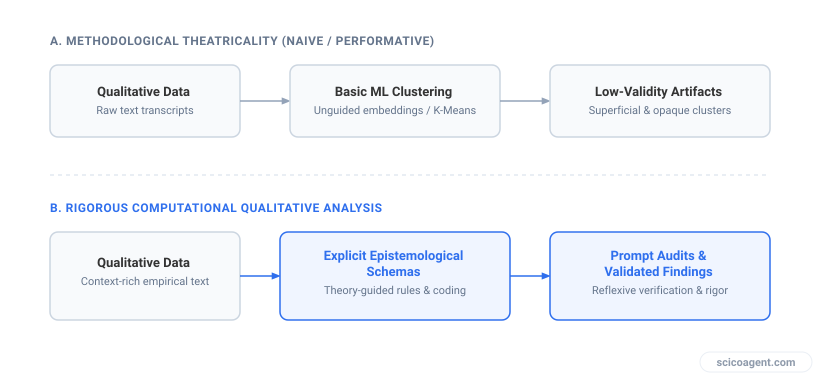
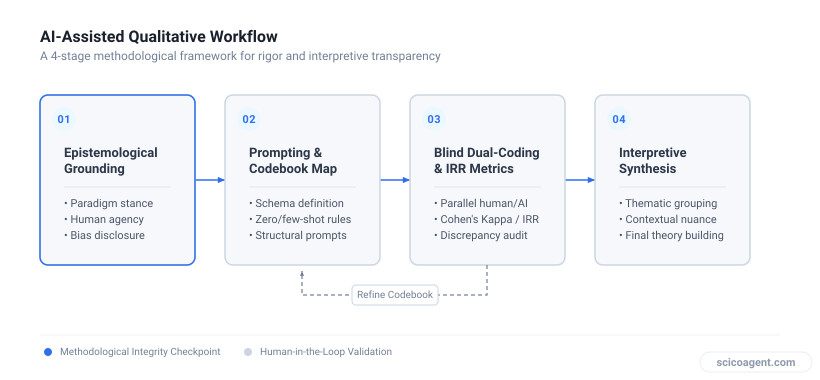
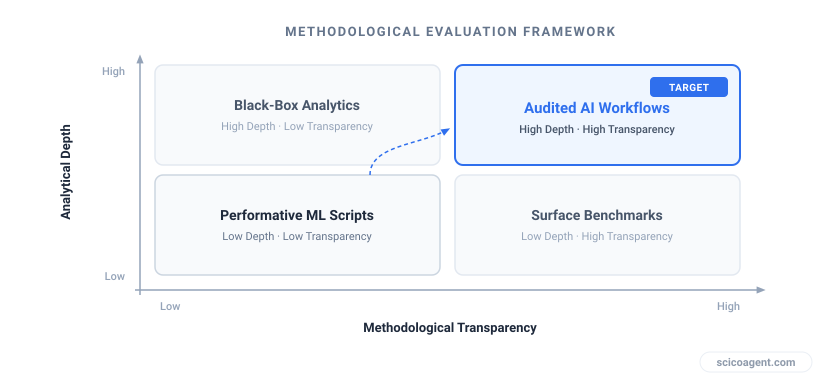

In brief
<ul style="margin:0;padding-left:20px;"><li style="margin:6px 0;line-height:1.5;">Performing performative computational mechanics like sentiment analysis often undermines qualitative validity in peer review</li><li style="margin:6px 0;line-height:1.5;">Computational tools serve qualitative research best through systematic thematic extraction and transparent prompt auditing rather than quantitative conversion</li><li style="margin:6px 0;line-height:1.5;">Transitioning to AI-driven research requires epistemological clarity on whether LLMs function as coders, peer auditors, or pattern generators</li></ul>

Qualitative scholars do not need to become amateur Python programmers to publish in top-tier journals. They need to formalize their prompt architecture, operationalize their codebooks, and build transparent epistemological audit trails.

## The Scopus Panic and the Mirage of the Python Pivot

A qualitative researcher recently posted on an academic forum with a familiar confession: they were struggling to publish in high-impact, Scopus-indexed journals and felt compelled to learn Python and R just to keep their research viable.

This anxiety is widespread across the social sciences and humanities. As top journals increasingly demand methodological innovation, qualitative researchers face intense pressure to adopt computational artificial intelligence and machine learning techniques. The resulting instinct is predictable. Scholars attempt to rebrand inductive text analysis as computational text mining, rushing to learn code libraries to run unsupervised topic modeling or automated sentiment scores on interview transcripts.

*Flawed versus Rigorous Integration of Computational Tools in Qualitative Research*

This reaction misdiagnoses what peer reviewers in high-impact publications expect. Reviewers in top journals do not reject qualitative papers because they lack lines of custom code. They reject papers when analytical frameworks lack reproducibility, systematic coding schemas, or scalability. Rushing to script a basic machine learning model to process qualitative text often produces performative computation: complex technical machinery applied to human language without the theoretical nuance required to yield genuine scientific discovery.

## Why Conventional Computational Shifts Fail Qualitative Science

When scholars attempt a rapid shift to machine learning techniques without restructuring their underlying research design, three specific methodological failures routinely surface during peer review.

First, traditional machine learning models treat qualitative text as an uncontextualized bag of words. This approach strips away syntax, sarcastic inflections, narrative structure, and institutional nuances. When applied to unstructured interviews or ethnographic field notes, the resulting computational topics are frequently either blatantly obvious or contextually meaningless.

Second, forcing qualitative inquiry into rigid quantitative machine learning frameworks creates a fundamental validity mismatch. Qualitative research evaluates truth through construct validity, theoretical saturation, and contextual authenticity. Conventional machine learning algorithms optimize for statistical prediction accuracy and variance explained. Treating human narrative strictly as a numerical vector matrix discards the primary analytical value of qualitative inquiry.

| Methodological Dimension | Performative AI Pivot | Rigorous AI-Driven Qualitative Design |
| :--- | :--- | :--- |
| Primary Goal | Convert text to numbers or scripts to appear technically advanced | Scale systematic qualitative coding while preserving context |
| Analytical Unit | Word frequencies, tf-idf tokens, uncontextualized clusters | Semantic units, thematic constructs, grounded categories |
| Transparency Mechanism | Black-box algorithmic output or basic script execution | Published prompt protocols, codebooks, and audit trails |
| Role of Researcher | Passive consumer of algorithmic outputs | Active epistemological auditor and interpretive synthesizer |

Third, performative computational approaches introduce severe reproducibility flaws. Researchers often pass qualitative data through non-reproducible scripts or unprompted model calls without documenting parameter configurations, systemic biases, or coding taxonomies. Instead of elevating the manuscript to top-tier standards, this procedural opacity triggers immediate skepticism from scientific reviewers.

## A Rigorous Framework: How to Transition to AI-Driven Research

Modernizing your methodology does not require relinquishing interpretive rigor or pretending to be a computational data scientist. To successfully complete a transition to AI-driven research in qualitative fields, scholars must focus on three core operational requirements: explicit operationalization, prompt auditing, and hybrid human-in-the-loop verification.

*Systematic Workflow for AI-Driven Qualitative Methodology*

### 1. Define Epistemological Roles
Before running any artificial intelligence model, establish its exact functional role within your epistemology. Is the computational tool acting as an automated assistant coder, a preliminary pattern detector, or an adversarial peer auditor? If the tool acts as a coder, it requires a fully articulated codebook with clear inclusion rules, exclusion rules, and exemplar quotes, exactly like a human research assistant.

### 2. Standardize Prompt Engineering as Codebook Design
In AI-driven qualitative research, a system prompt is not an informal conversational query. It is a formal research instrument. A publishable methodology documents system prompts with the same precision used for structured interview protocols. Specify the contextual background, output formatting, structural boundaries, and explicit analytical constraints required for coding.

### 3. Conduct Dual-Coding and Calculate Agreement
To satisfy reviewers in Scopus-indexed journals, run systematic agreement checks. Sample a subset of qualitative units, code them independently with expert human coders, execute the artificial intelligence protocol, and measure inter-rater reliability using recognized statistical measures such as Cohen's kappa or Krippendorff's alpha. Demonstrating high statistical agreement between expert human coders and an automated coding protocol provides empirical evidence of procedural reliability.

*Evaluating Methodological Rigor in Computational Qualitative Research*

### 4. Maintain a Public Audit Trail
Top journals prioritize open science and procedural transparency. Publish the complete prompt architecture, data sanitization protocols, model identifiers, temperature parameters, and qualitative variance analyses alongside your manuscript.

## The Unexpected Truth About Methodology Modernization

Researchers often assume that modernizing qualitative methodology requires replacing human interpretive depth with complex quantitative algorithms. The drive to adopt artificial intelligence in research is frequently framed as a transition from qualitative understanding to quantitative calculation.

The actual outcome of integrating modern AI tools into research design is precisely the opposite.

By stripping away the mechanical labor of manual transcript organization, artificial intelligence does not turn qualitative research into quantitative science. Instead, it forces qualitative researchers to become far more rigorous qualitative thinkers. To instruct an AI system to analyze text accurately, you cannot rely on intuitive hand-waving or unarticulated scholarly instincts. You are forced to explicitly operationalize your implicit theoretical assumptions, refine your codebooks with mathematical precision, and defend your interpretive leaps with structured audit trails. The true value of transitioning to AI-driven research is not that it makes your work quantitative; it is that it makes your qualitative methodology unassailable.
