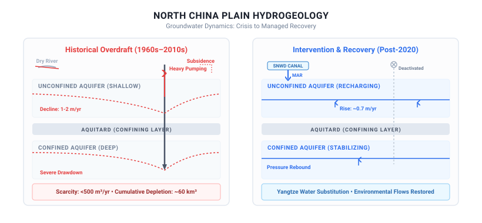
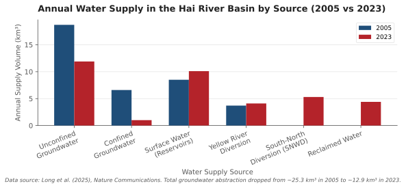

## How one of the world's most depleted aquifers reversed decades of decline, and what it teaches us about regional water management.

When we evaluate global water security, we are trained to expect stories of irreversible decline, but a massive aquifer system has just broken the trend, proving that large-scale groundwater recovery is possible under coordinated human intervention. In a study published in Nature Communications, researchers documented a striking reversal of long-term groundwater decline in the North China Plain, a region spanning approximately 130,000 square kilometers (Di Long et al., 2025). By analyzing over 190,000 measurements from more than 2,000 monitoring wells, the team demonstrated that regional groundwater levels have risen at an average rate of about 0.7 meters per year since 2020.

To understand the mechanics of this recovery, it helps to use a financial analogy. Think of an aquifer as a massive regional savings account. For decades, the North China Plain was severely overdrawing this account, withdrawing groundwater for agriculture and municipal use far faster than natural precipitation could deposit it. To stop the bankruptcy of the system, managers had to do two things simultaneously: inject a massive external inheritance (diverting surface water from the humid south) and set strict limits on daily withdrawals (shutting off local wells). 

While this analogy helps visualize the water balance, it simplifies the physical reality. In nature, the savings account is split into two distinct compartments. The first is the unconfined aquifer, which is shallow and directly replenished by local rain. The second is the confined aquifer, a deeper layer sealed beneath impermeable clay, which is highly pressurized and much harder to recharge once depleted.

*Decades of intensive agricultural irrigation and municipal pumping depleted the North China Plain's aquifers by roughly 60 km³, leading to land subsidence and drying rivers. Large-scale human intervention, combining South-to-North water diversions, strict groundwater extraction caps, and river/lake replenishment, engineered a historic reversal in groundwater decline.*

## The Dual-Engine Mechanism of Large-Scale Groundwater Recovery

The recovery of the North China Plain aquifer was not an accident of nature, but the result of two primary policy interventions working in tandem. 

First, the South-to-North Water Diversion (SNWD) project, specifically its central route which began operations in December 2014, redirected high-quality surface water from the Danjiangkou Reservoir on the Han River (a tributary of the Yangtze River) to northern cities. This imported water directly replaced groundwater pumping for municipal and industrial needs. Additionally, excess diverted water was used to replenish dry riverbeds and actively recharge shallow aquifers through managed aquifer recharge, which is the process of intentionally flooding land to let water seep back into the ground.

Second, local governments enforced strict pumping regulations. When surface water became available, agricultural and municipal wells were shut off. For agriculture, which historically consumed 70 percent of the region's water, policies encouraged dryland farming, seasonal fallowing, and the use of plastic mulch to conserve soil moisture. Together, these measures reduced annual groundwater extraction in the Hai River basin by approximately 12 cubic kilometers between 2005 and 2023.

*Between 2005 and 2023, targeted interventions reduced annual groundwater extraction in the Hai River Basin by ~12 km³. Pumping from deep confined aquifers fell by 85% and shallow unconfined aquifers by 36%, replaced by South-to-North surface water diversions, increased reservoir allocations, and reclaimed water.*

## The Data: Quantifying the Aquifer Rebound

The physical impact of these interventions is clear in the long-term monitoring data. The study analyzed depth-to-groundwater trends across two decades, dividing the historical record into a depletion phase (2005 to 2017) and a recovery phase (2018 to 2024).

During the 2005 to 2017 period, depletion was the dominant signal. Approximately 62 percent of monitoring wells in unconfined aquifers and 83 percent in confined aquifers showed significant deepening trends. The average decline in shallow aquifers was about 0.2 meters per year, while deep confined aquifers fell by 0.5 meters per year. 

The turning point arrived around 2020. During the 2018 to 2024 period, more than half of the monitoring wells showed significant shallowing trends, and about a quarter experienced a complete reversal of their declining trends. Between 2020 and 2024, groundwater levels rose by an average of 0.7 meters per year in unconfined aquifers and recovered by about 4 meters overall in confined aquifers. In fact, by 2024, the average water level in shallow unconfined aquifers had returned to levels last seen in 2005.

## A Framework for Assessing Aquifer Recovery Potential

For geologists and water managers looking to replicate these results in other depleted drylands, the North China Plain study offers a practical framework. You can evaluate a region's potential for large-scale groundwater recovery by running through a three-step checklist:

1. **Assess Substitution Capacity:** Can you secure an alternative water source (such as surface water diversion, desalinated water, or reclaimed wastewater) to completely replace groundwater for high-priority municipal and industrial uses?
2. **Implement Dual-Control Regulations:** Are there policy mechanisms in place to both restrict groundwater pumping (by closing wells) and manage agricultural demand (through crop adjustments and fallowing)?
3. **Leverage Environmental Allocations:** Can you direct excess surface water during wet years into natural river channels and managed aquifer recharge basins to accelerate passive and active replenishment?

## The Surprising Limit of Imported Water

The success of the North China Plain suggests a straightforward lesson: if you import enough water and restrict pumping, aquifers will heal. But a closer look at the data reveals a deeper, more complicated reality. 

While the recovery was driven by human engineering, it was heavily amplified by natural climate variability, particularly the exceptionally wet year of 2021. When drought conditions returned to the source region of the South-to-North Water Diversion project in 2022 and 2023, the volume of diverted water delivered to the north fell by 16 percent, dropping from 6.3 cubic kilometers to 5.3 cubic kilometers. Consequently, the rate of groundwater recovery slowed down significantly after 2021. 

This reveals a fundamental truth about water management. Mega-engineering projects do not actually solve water scarcity, they merely redistribute the geographic risk of drought. By relying on water diverted from thousands of kilometers away, a recovering aquifer remains tethered to the climate health of an entirely different river basin. True hydrological resilience cannot be imported, it must ultimately be built on local balance.

## Sources

Di Long et al. (2025). Unprecedented large-scale aquifer recovery through human intervention. Nature Communications. https://doi.org/10.1038/s41467-025-62719-5
