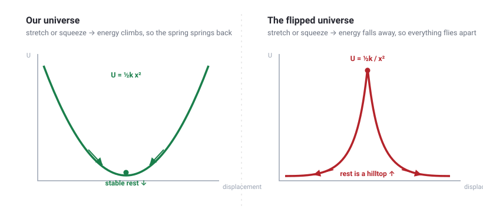
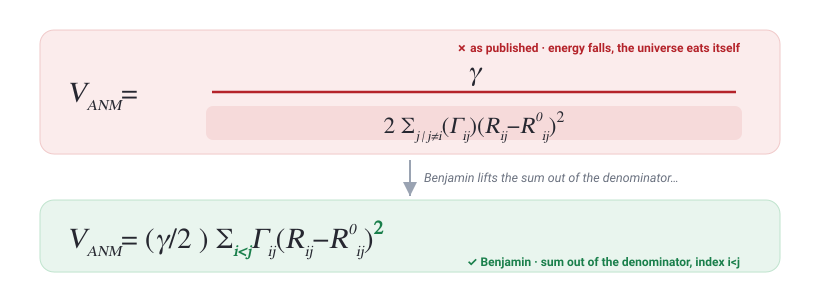

Have you ever pulled on a spring?

When you feel it push back, that resistance is just the spring drinking your energy and storing it up. Stretch it further, and it drinks even more. Squeeze it, and the exact same thing happens. The further you drag it from its happy resting length, the more energy it hoards. Its potential energy $U = \tfrac{1}{2}kx^{2}$ climbs right along with the displacement $x$. That single, humble rule explains why springs spring, why mattresses bounce back, and why a plucked guitar string eventually returns to the middle instead of sailing off into the night.

Now, let me hand you the keys to a totally different universe where one tiny rule is flipped.

## The Universe That Eats Itself

In this bizarre universe, a spring actually gets **weaker** the more you deform it. Its resting length is no longer a cozy valley it rolls back into - it acts like the peak of a steep hill that it is frantic to escape.

*Left, our universe: rest is a valley. Right, the flipped one: rest is a hilltop, and every spring is a fugitive from it.*

If you lived there for five seconds, everything would go wrong at once:

*   Every spring is essentially a cocked trap. Its lowest-energy dream is to be stretched to **infinity**, meaning nothing ever holds still.
*   Sit on a mattress, and it launches you straight through the roof. Click a pen, and it detonates.
*   And here is the real kicker: **atoms are held together by exactly these springs.** If you flip the rule, every molecule in existence rips itself to shreds in an instant. Proteins unravel for sport. Chemistry unravels right along with them.

It is a universe that devours itself the moment it gets switched on. Obviously, that is not our universe.

Obviously.

## Except a Highly Cited Paper Says It *Is*

Here is a real equation representing the potential energy of the Anisotropic Network Model (ANM), a model that treats a whole protein like a lattice of springs. It comes straight out of a genuinely famous, heavily-cited paper published in [[*Bioinformatics* (Eyal, Yang &amp; Bahar, 2006)](https://doi.org/10.1093/bioinformatics/btl448)].

Look closely at Equation 1 from their publication:

$$
V = \dfrac{\gamma}{2\sum_{j\,\mid\,j\neq i}\left(\Gamma_{ij}\right)\left(R_{ij}-R_{ij}^{0}\right)^{2}}
$$

Do you see where the summation and the squared displacement $(R_{ij}-R_{ij}^{0})^{2}$ are sitting? They are entirely trapped inside the **denominator**.

This is the mathematical equivalent of the universe eating itself. As the distance between two atoms ($R_{ij}$) stretches further away from equilibrium ($R_{ij}^{0}$), the denominator gets larger. This means the total potential energy $V$ gets *smaller*. The equation literally insists that the protein's lowest-energy state is to explode outward into infinite space.

Welcome to the universe that eats itself.

## How Is This Possible?

How does an impossible, physics-breaking formula slip past the brightest minds in the room, survive peer review, and cement itself in the scientific record? 

It definitely does not happen by accident. It is the result of a silent, systemic failure we trust far too much. It happens through a dangerous illusion known as **incorrect proofreading**.

During the publication process, a publisher's automated LaTeX-to-XML typesetting tool likely glitched. It ended up dragging the entire right side of the equation under the fraction bar.

But why did nobody catch it? Typos this small easily sail through authors, co-authors, three peer reviewers, and a copy-editor because we have been proofreading the wrong thing entirely.

A standard spell-checker looks at $(R-R^{0})^{2}$ and thinks it looks like perfectly fine English. To a basic grammar tool, a subscript is just a subscript. These tools only ever audit the *spelling*. They have never once audited the actual *meaning*.

The only reader who can catch a physics-breaking symbol is someone who actually understands the physics, the notation, and the surrounding context. Unfortunately, that reader is usually *you*, sitting at your desk at 2 a.m., staring at a manuscript you have re-read forty times until the equations just look like wallpaper.

We have a specific name for these: **SciTypos** (Scientific Typos). They thrive in the blind spots of traditional editing software.

## Enter Benjamin: Your Third Eye

This exact problem is why we built **[Benjamin](https://benjamin.scicoagent.com)**, our scientist-proofreader. As the dedicated proofreading agent within the broader [SciCoagent](https://scicoagent.com) suite, it is a context-aware service built specifically for scientists, by scientists.

Benjamin is **not** a typical grammar app. It is **not** just a spell-checker. It reads your manuscript the exact same way a razor-sharp principal investigator would. It tracks your units, your symbols, and your matrices - and it flags the SciTypos that ordinary tools are constitutionally blind to.

Think of it as your **third eye**. It provides an extra pair of lenses that reads what you *actually wrote*, rather than what you *meant to write*. It works seamlessly on `.docx` and LaTeX files, proofreading the mathematics directly *inside* your equations. If you write in LaTeX, here is [how Benjamin proofreads a LaTeX paper](/blog/latex-proofreader/).

## See It Hunt

Here are the kinds of SciTypos that Benjamin catches on a real document - the everyday errors that ordinary spell-checkers and grammar tools wave straight through:

And, fittingly, how does Benjamin fix the very spring that opened this story? It reads the ANM potential symbol by symbol. It actively pulls the sum out of the denominator where it belongs, and it flags the sloppy $j \mid j \neq i$ index. It then replaces it with the mathematically elegant $i < j$ to completely prevent double-counting interactions.

*As published, the sum was trapped in the denominator; Benjamin lifts it back out and tidies the summation index. No infinite explosions. No self-eating universe. Just rigorous, flawless biophysics.*

$$
V_{\mathrm{ANM}} = \dfrac{\gamma}{2}\sum_{i<j}\Gamma_{ij}\left(R_{ij}-R_{ij}^{0}\right)^{2}
$$

---

One stray character really can conjure a universe that eats itself. Let's keep that universe off the page.