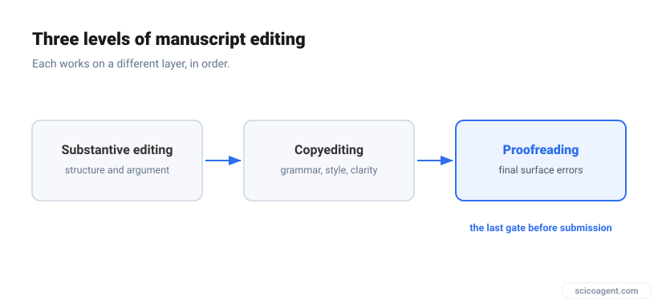
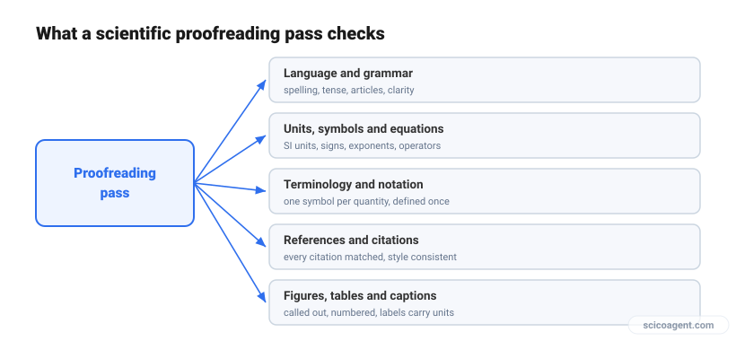

In brief
<ul style="margin:0;padding-left:20px;"><li style="margin:6px 0;line-height:1.5;">Proofreading a scientific manuscript is the final check for surface errors before submission, run after the science, the structure, and the wording are already settled.</li><li style="margin:6px 0;line-height:1.5;">The errors that matter most are the ones spell-checkers miss: units, symbols, notation, equations, references, and figure or table labels.</li><li style="margin:6px 0;line-height:1.5;">Proofread in separate focused passes rather than one read, because reading for meaning and reading for errors draw on different kinds of attention.</li></ul>

### What to check, in what order, and where automated tools genuinely help before you submit.

You have written the paper, the figures are in, and the argument holds. So why does a reviewer still open with a list of small errors you could have caught yourself?

Proofreading a scientific manuscript is the last stage of editing. It is the pass that catches the small, surface-level errors that survive drafting: a wrong unit, a flipped sign, an inconsistent symbol, a citation that points at the wrong paper. It happens after the science, the structure, and the wording are settled, and its only job is to make sure nothing on the page misrepresents the work.

It matters because those errors are what a reader notices first. A reviewer who finds three typos in the abstract reads the rest more skeptically. An editor who spots a units mismatch in a table wonders what else went unchecked. None of it changes your result, but all of it changes how the result is received, and a paper heavy with avoidable slips is more likely to be sent back at the desk-review stage, before it ever reaches peer review.

## What "proofreading scientific manuscripts" means

Proofreading is often used loosely to mean "any final read," but in editing it names one specific stage. It is worth separating three levels of work, because they use different skills and belong at different times.

- **Substantive editing** works on the science and the structure: whether the argument is sound, the sections are in the right order, and the claims match the evidence.
- **Copyediting** works on the language: grammar, tense, word choice, sentence flow, and consistency of style.
- **Proofreading** is the final gate. It assumes the science and the language are done and looks only for surface errors that would embarrass the paper or mislead the reader.

For a scientific manuscript, proofreading carries more weight than it does in general writing, because so much meaning lives in symbols rather than sentences. A superscript read as a subscript changes an exponent into an index. A missing minus sign inverts a result. These are proofreading errors, not science errors, and they are invisible to a tool that only checks spelling.

*Proofreading is the final gate before submission, after substantive editing and copyediting are done.*

| Aspect | Copyediting | Proofreading |
| :--- | :--- | :--- |
| **When** | Before the manuscript is finalized | Last step before submission |
| **Focus** | Grammar, style, clarity, consistency | Surface errors: typos, units, notation, references |
| **Changes the wording?** | Often, to improve flow | Only to fix an outright error |
| **Main risk if skipped** | The paper reads awkwardly | The paper misstates the work |

## The scientific proofreading checklist

A useful proofreading pass is not a single read for "mistakes." It is a set of focused checks, each looking for one class of error. The five below cover what reviewers and editors flag most often in scientific manuscripts.

- **Language and grammar.** Spelling, verb tense (results in the past, established facts in the present), articles, subject-verb agreement, and any sentence that could be read two ways.
- **Units, symbols, and equations.** Correct and consistent SI units, no missing or flipped signs, exponents and indices in the right position, matched delimiters, and operators (integral, sum, product) with the bounds they were meant to carry.
- **Terminology and notation consistency.** One symbol for one quantity throughout, every abbreviation defined at first use, and gene, species, chemical, and variable names written the same way on every page.
- **References and citations.** Every in-text citation present in the reference list and the reverse, numbering or author-year style applied consistently, and each citation actually pointing at the paper you meant.
- **Figures, tables, and captions.** Every figure and table called out in the text, numbered in order, with captions that match the panels and axis labels that carry units.

*A scientific proofreading pass runs five focused checks over the manuscript.*

## A step-by-step proofreading pass

Reading a manuscript once and hoping to catch everything rarely works, because the same attention that follows an argument tends to skip over surface errors. Splitting the work into ordered steps is what makes proofreading reliable.

1. **Rest the draft first.** Leave at least a day between finishing the writing and proofreading it, so you read what is on the page rather than what you meant to write.
2. **Change how it looks.** Read a printout, or switch the font and zoom, or compile the PDF. A different layout breaks the pattern your eyes have memorized and surfaces errors you had stopped seeing.
3. **Read once for sense.** Confirm the manuscript still reads cleanly end to end before hunting for small errors. Fixing a sentence you later delete is wasted effort.
4. **Run the technical-accuracy pass.** Check units, signs, exponents, indices, and every equation on its own terms, ignoring the prose around it.
5. **Run the consistency pass.** Track one symbol, term, or abbreviation at a time across the whole document and confirm it never drifts.
6. **Check references, figures, and tables.** Match every citation to the list, every figure and table to its callout, and every caption to what it describes.
7. **Format to the journal.** Apply the target journal's style for headings, references, figure resolution, and word or page limits as the final step.

## The errors that slip past spell-checkers

Most drafting tools check spelling and basic grammar well, which is exactly why the errors that reach reviewers are the ones those tools cannot see. In scientific manuscripts they cluster in a few places:

- **Units.** A rate written as `mg/L` in the methods and `mg/mL` in the results, or a temperature that switches between Celsius and kelvin.
- **Sign and exponent errors.** A dropped minus sign, or `10^-3` typed as `10^3`, which passes every spelling check and inverts the magnitude.
- **Notation drift.** The same quantity written as two symbols, or one symbol reused for two quantities in different sections.
- **Equation typos.** A subscript nested where it should be a separate index, or a delimiter that no longer scales to the fraction it encloses, so the equation compiles cleanly while meaning something else.
- **Reference mismatches.** A citation that survived a round of edits but now points at the wrong paper, or a reference in the list that no longer appears in the text.

We built Benjamin to proofread LaTeX, Word, plain-text, and RTF manuscripts for exactly this class of error, checking grammar, units, notation, and the formatting integrity of equations in context. It returns the result as tracked changes you accept or reject, in Word's native Track Changes or an inline LaTeX diff. It corrects; it does not rewrite your science, and no tool replaces peer review.

## Manual, AI-assisted, or both

Careful human proofreading remains the standard, and for good reason: some checks need judgment a tool cannot supply. Whether a symbol's meaning is clear from context, whether an implied convention will be understood by readers in your subfield, and whether a sentence says what you intended are decisions that rest on domain expertise.

What automated tools do well is the mechanical, exhaustive part: reading every line at the same level of attention, never getting tired at reference forty, and flagging a unit or notation that changed three sections ago. That is the part humans skip when a deadline is close. The practical answer for most manuscripts is both: let a tool make a complete first pass so nothing is missed, then bring human judgment to the flags it raises and the meaning it cannot see.

## Frequently asked questions

**What is proofreading in the context of a scientific manuscript?**
Proofreading a scientific manuscript is the final editing stage before submission, focused on catching surface errors in language, technical detail, and consistency after the science and structure are already settled. It covers spelling and grammar as well as units, symbols, equations, references, and figure and table labels.

**How is proofreading different from copyediting?**
Copyediting improves the language while the manuscript is still being finalized, working on grammar, style, clarity, and consistency. Proofreading is the last step and looks only for outright errors, changing wording only to fix a mistake rather than to improve flow.

**What should you check when proofreading a research paper?**
Check five things: language and grammar, units and symbols and equations, terminology and notation consistency, references and citations, and figures and tables with their captions. The technical and consistency checks matter most in science, because they are the errors spell-checkers cannot see.

**When should you proofread a manuscript?**
Proofread last, after every substantive and language edit is done, and ideally after leaving the draft alone for at least a day. Proofreading a version you will still revise wastes effort, because errors move or disappear with the next round of edits.

**Can AI proofread scientific manuscripts?**
Yes, for the mechanical and exhaustive part. Tools built for scientific text can read a full manuscript at consistent attention and flag errors in units, notation, equations, and references that general spell-checkers miss. Judgment about meaning and subfield convention still needs a human, so AI proofreading works best as a complete first pass that a researcher then reviews.

**Do you still need proofreading if English is your first language?**
Yes. Most proofreading errors in scientific manuscripts are technical rather than linguistic, so a native English speaker misses flipped signs, drifting notation, and reference mismatches just as easily as anyone else.

The instinct is to treat proofreading as polish, the cosmetic step you do if there is time. In a scientific manuscript it is closer to the opposite. So much of the meaning is carried by units, symbols, and equations that a single surface error can quietly change what the paper claims. Proofreading is not about making the writing look tidy. It is the last chance to make sure the page says what the work actually found.
