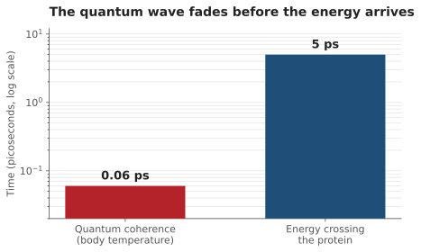

Here is a headline that keeps coming back: life is quantum. Photosynthesis runs at nearly perfect efficiency because plants exploit quantum weirdness. Migratory birds navigate by sensing the Earth's magnetic field with entangled electrons. The warm, wet, noisy inside of a living cell, long assumed far too chaotic for anything as delicate as quantum mechanics, turns out to be running on it after all.

It is a wonderful story, and parts of it are genuinely true. But the three examples almost always get told as one, and they are not equal. The most famous one is the shakiest. The most solid one barely gets mentioned. And the most beautiful one is, honestly, still unproven.

## The famous one that got quietly downgraded

In 2007, a team led by Greg Engel watched energy move through a light-harvesting protein borrowed from green sulphur bacteria, and saw it behave like a wave rather than a particle. Instead of hopping at random from one molecule to the next, hunting for the exit, the energy seemed to explore many paths at once, as a single quantum superposition, and so find the fastest route out. It looked like photosynthesis had found a quantum shortcut to its famous efficiency.

The catch is in the fine print. That experiment ran at 77 kelvin. This is minus 196 Celsius, the temperature of liquid nitrogen. A leaf on a summer afternoon is not that.

Warm the system back up to the temperature of a living thing and the delicate part, the electronic quantum wave, fades in well under a tenth of a picosecond. The energy itself needs several picoseconds to cross the protein. The wave is gone roughly fifty times over before the energy arrives.

*The delicate quantum part fades long before the energy finishes its trip. Whatever survives that long is mostly molecules jiggling, not the superposition that made the headline.*

By 2017 the reappraisal had a title that did not bother being polite. A team writing in the *Proceedings of the National Academy of Sciences* called their paper *Nature does not rely on long-lived electronic quantum coherence for photosynthetic energy transfer.* The poster child of quantum biology, the one image everyone remembers, is the example the field has spent a decade walking back.

## The solid one nobody puts on the cover

Meanwhile, a real quantum effect has been doing biological work inside you this entire time, and it never got a magazine cover.

Enzymes are the machines that speed up the chemistry of life, and a great deal of what they do is move hydrogen atoms from one place to another. Classically, a hydrogen atom has to climb over an energy barrier to make that trip. If the barrier is high, it waits. Quantum mechanics hands it a second option: pass straight through the barrier without ever climbing it. That is tunneling.

How would you catch a hydrogen atom in the act? Swap it for its heavier twin, deuterium, which is the same atom with one extra neutron. Both versions climb over a barrier at almost the same rate, so if the reaction were purely classical, the heavier one would slow the enzyme only a little. The theoretical ceiling for that classical slowdown is about a factor of seven.

One enzyme, soybean lipoxygenase, slows down by a factor of eighty one.

*Past the classical ceiling by more than tenfold. The light hydrogen slips through the barrier; the heavier one, worse at tunnelling, mostly cannot.*

That number is impossible for an atom going over the wall. It only happens if the light hydrogen slips through the barrier while the heavier one, clumsier at tunneling, largely cannot. This has been measured and re-measured for two decades. It is about as settled as biology gets. The quantum effect that is beyond serious doubt, and running in every cell you own right now, is the one nobody thought to hype.

## The beautiful one that might be true

Then there is the example that would be the most astonishing of all, if it holds: birds that find their way by sensing the Earth's magnetic field directly.

The leading idea is a chemical compass. Light strikes a protein called cryptochrome in the bird's eye and knocks an electron loose, creating two fragments whose quantum spins are linked. The Earth's magnetic field is far too weak to push anything mechanical around, but it can still tip the balance between two spin arrangements, and that shifts the chemistry the protein produces. In principle, the bird could read that shift as a direction. A compass it sees rather than feels.

In 2021, this got its strongest evidence yet. A team showed that cryptochrome taken from the eye of the European robin, a night migrant, really is sensitive to magnetic fields in a test tube, and more sensitive than the same protein pulled from chickens and pigeons, which do not migrate the same way.

Here is the honest edge. That is a protein in a tube, not a bird finding its way to Africa. The magnetic effect on the molecule is real and measured. The link from that molecule to what the animal actually does in the night sky is still open. This is a frontier, not a finished result, and it is the most exciting of the three precisely because it is the least settled.

## So, does life run on the quantum realm?

Not the way the headline means. The picture that survives contact with the data is narrower, and to me far more interesting. One quantum effect, tunneling, is doing real biological work and is beyond reasonable doubt. One, the bird compass, is genuinely promising and honestly unproven. And the most famous one, quantum coherence powering photosynthesis, has been quietly demoted from mechanism to footnote.

Notice the pattern, because it is the same one that shows up whenever a field gets exciting, and it travels straight into yours:

> **How famous a result is tells you how astonishing it sounds. It tells you almost nothing about whether it is true.**

Fame tracks the size of the claim, not the weight of the evidence behind it. The loudest example here was the weakest. The one quietly running in your cells got no headline at all.

The warm, wet cell really is, for the most part, too noisy for the delicate quantum effects, exactly as everyone first suspected. Which is what makes the few places those effects genuinely survive worth all of the attention, and worth being honest about which places those actually are.

The boundary between quantum physics and biology is not dissolving. It is being drawn, carefully, one honest experiment at a time. And a line drawn honestly is worth far more than one erased by a headline.

---

## Sources

- Engel, G. S. et al. (2007). [Evidence for wavelike energy transfer through quantum coherence in photosynthetic systems](https://www.nature.com/articles/nature05678). *Nature* **446**, 782. (The original result. Coherence lasting beyond 660 femtoseconds, measured at 77 K.)
- Duan, H.-G. et al. (2017). [Nature does not rely on long-lived electronic quantum coherence for photosynthetic energy transfer](https://www.pnas.org/doi/10.1073/pnas.1702261114). *PNAS* **114**, 8493. (The reappraisal, and the source of the title everyone quotes.)
- Knapp, M. J., Rickert, K. & Klinman, J. P. (2002). [Temperature-Dependent Isotope Effects in Soybean Lipoxygenase-1: Correlating Hydrogen Tunneling with Protein Dynamics](https://doi.org/10.1021/ja012205t). *Journal of the American Chemical Society* **124**, 3865. (The kinetic isotope effect of 81, the fingerprint of deep hydrogen tunneling.)
- Xu, J. et al. (2021). [Magnetic sensitivity of cryptochrome 4 from a migratory songbird](https://www.nature.com/articles/s41586-021-03618-9). *Nature* **594**, 535. (The European robin cryptochrome, magnetically sensitive in vitro, more so than in non-migratory birds.)
- Hore, P. J. & Mouritsen, H. (2016). [The Radical-Pair Mechanism of Magnetoreception](https://doi.org/10.1146/annurev-biophys-032116-094545). *Annual Review of Biophysics* **45**, 299. (How the proposed chemical compass is thought to work.)
