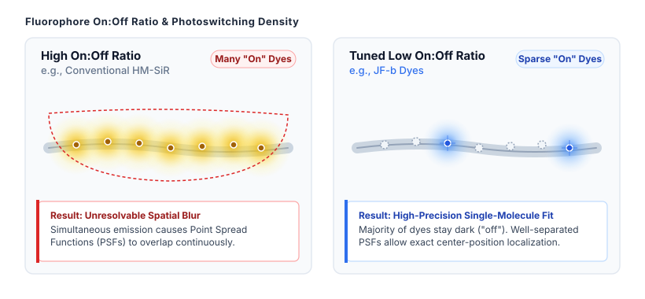
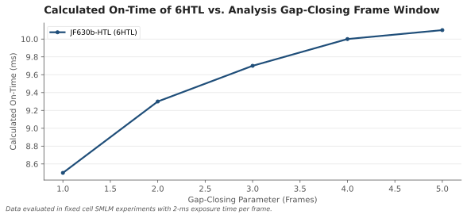

### Why matching fluorophore on:off ratios to sample environment and acquisition speed is essential for quantitative SMLM and SOFI.

Single-molecule localization microscopy (SMLM) and super-resolution optical fluctuation imaging (SOFI) bypass the classical diffraction limit of light by separating individual fluorophore emissions in time. Spontaneously blinking fluorophores simplify these super-resolution methods by toggling between dark and fluorescent states without requiring phototoxic ultraviolet caging lasers or noxious chemical redox buffers. 

However, early spontaneously blinking probes such as hydroxymethyl-Si-rhodamine (HM-SiR) present a fundamental limitation. The intrinsic on:off ratio of HM-SiR is too high for general super-resolution imaging. When too many fluorophores fluoresce simultaneously, single-molecule signals overlap, causing localization algorithms to fail. 

A recent study by Katie L. Holland et al. (2026) demonstrates that systematically tuning the chemical structure of Janelia Fluor (JF) dyes yields a panel of spontaneously blinking probes spanning two orders of magnitude in on:off ratios. Matching these fluorophores to specific target densities, imaging modalities, and organellar microenvironments is key to optimizing subdiffraction imaging.

## The Physics of Blinking Dyes and the On:Off Ratio

To understand why a single dye cannot serve every imaging need, consider an everyday analogy. Imagine trying to resolve individual fireflies in a dense forest at night. If every firefly remains continuously lit for several seconds, their light blurs together into an unresolvable glow. If each firefly emits brief, isolated flashes separated by long dark intervals, you can easily pinpoint every distinct position. 

However, if the dark interval between flashes becomes too long, capturing enough distinct events to map the entire forest takes hours. The analogy breaks down in biological systems because fireflies do not alter their flash rates based on local chemical gradients or fixatives, whereas organic fluorophores interact dynamically with their immediate physicochemical environment.

*Conventional spontaneously blinking dyes possess high on:off equilibrium ratios, causing too many molecules to emit light simultaneously. This produces overlapping signal spots that prevent precise single-molecule localization.*

To address signal overlap in super-resolution microscopy, Holland et al. synthesized a divergent series of spontaneously blinking dyes named JFX650b through JF614b (compounds 2–9). By systematically introducing electron-withdrawing substituents, such as azetidine and deuterated pyrrolidine rings, the authors altered the pKa of the dyes. 

Modulating the chemical pKa shifts the thermodynamic equilibrium between the non-fluorescent spirocyclic form (the "off" state) and the protonated, fluorescing zwitterionic form (the "on" state). While the average time a fluorophore spends in the "on" state remains relatively stable at roughly 10 milliseconds across the series, the duration of the "off" state increases substantially as pKa drops. This systematic modification tunes the overall on:off ratio from approximately 10⁻² for JFX650b down to 10⁻⁴ for JF614b.

For SMLM in fixed cells, dyes with low to intermediate on:off ratios, such as JF630b (6HTL), eliminate signal overlap while maintaining high photon yields. Fixed cells expressing HaloTag fusions to Sec61β, TOMM20, or histone H2B labeled with JF630b consistently yield localization precisions (σ) of 13 nm or better. Similarly, 3D interferometric photoactivated localization microscopy (iPALM) utilizing JF635b (5HTL) achieves spatial precisions under 12 nm across all three dimensions.

## Processing Parameters and Measuring Fluorophore On-Times

Quantifying the physical blinking parameters of a fluorophore requires careful separation of real molecular switching events from optical noise and transient photon fluctuations. When tracking single molecules across sequential camera frames, single-molecule analysis software uses a gap-closing parameter. This parameter defines how many consecutive dark frames can elapse before a temporarily dim fluorophore is classified as turned off rather than temporarily uncollected due to Poisson noise.

*Measured fluorescence on-time for the spontaneously blinking fluorophore JF630b–HaloTag ligand (6HTL) as a function of the frame gap-closing tolerance parameter during single-molecule localization microscopy (SMLM) data processing.*

Data from Holland et al. illustrates how post-acquisition processing settings influence calculated kinetics. When evaluating fixed COS-7 cells labeled with JF630b (6HTL) at a 3-millisecond cycle time, changing the gap-closing window shifts the measured mean on-time. 

A gap-closing window of 1 frame yields a calculated on-time of 8.5 ± 0.7 ms. Expanding the gap-closing parameter to 2, 3, 4, and 5 frames increases the calculated on-time to 9.3 ± 0.7 ms, 9.7 ± 0.6 ms, 10.0 ± 0.6 ms, and 10.1 ± 0.6 ms, respectively. Because the values stabilize around 10 milliseconds, selecting a 5-frame gap bridges transient photon drops without falsely merging independent blinking events from separate molecules.

## Environmental Microdomains Invert Dye Performance

While SMLM requires sparse single-molecule emitters, SOFI relies on higher labeling densities and temporal intensity fluctuations. In live-cell cytosolic imaging, dyes with intermediate on:off ratios, such as JF639b (4HTL), provide optimal signal-to-noise ratios and shorter effective blinking periods (τ). 

Crucially, fluorophore blinking is not solely governed by internal molecular structure; it is heavily modified by local cellular microenvironments and sample preparation methods.

Inside live cells, acidic compartments such as lysosomes create a significant challenge for Si-rhodamine dyes. The low pH environment inside the lysosomal lumen promotes protonation, shifting fluorophores into their fluorescent open state and dramatically increasing their effective on:off ratio. When U2OS cells expressing HaloTag-CD63 are labeled with JF639b, the dye stays permanently turned on inside live lysosomes, eliminating intensity fluctuations and causing live-cell SOFI to fail completely.

To solve this, one must select JF614b (9HTL), the dye with the lowest baseline on:off ratio (~10⁻⁴). In neutral solution, JF614b blinks too rarely for standard cytosolic SOFI. Inside the acidic lysosomal lumen, however, the low pH elevates its on:off ratio into the ideal regime for fluctuation analysis, enabling super-resolution tracking of individual moving lysosomes.

Chemical fixation further highlights this microenvironmental dependency. When samples are fixed with paraformaldehyde, the lysosomal lumen is neutralized. Neutralization shifts JF614b back to its baseline dark state, rendering it ineffective for fixed-cell lysosomal SOFI. 

Conversely, fixation lowers the on:off ratio of JF639b back into its functional window, enabling high-quality fixed-cell SOFI images. Chemical fixation also alters HaloTag structural conformation near residue Lys106, shifting dye kinetics between live and fixed states across cytosolic targets.

## Practical Recommendations for Dye Selection

To achieve optimal resolution in super-resolution experiments, scientists must match fluorophore chemical properties to both the imaging modality and the physical sample condition:

1. **Fixed-Cell SMLM (High Target Density):** Select low on:off ratio dyes such as JF630b (6HTL) or intermediate dyes like JF635b (5HTL). These probes reduce fluorophore overlap while delivering high photon counts per blink, yielding localization precisions below 13 nm.
2. **Live-Cell Cytosolic SOFI:** Select intermediate on:off ratio dyes such as JF639b (4HTL). These probes provide fast temporal fluctuation kinetics (short τ) matched to frame rates near 100 Hz.
3. **Acidic Organelle Imaging (Live Lysosomes):** Select dyes with extremely low baseline on:off ratios, such as JF614b (9HTL). The acidic pH shifts the dye into a usable blinking regime that fails in neutral cytosolic environments.
4. **Biomolecular Condensates and In Vitro Assays:** For dense protein coacervates like FUS, lower on:off ratio probes (such as JF635b-maleimide) permit continuous single-molecule localizations throughout the core of the condensate where high-on-ratio probes like HM-SiR fail due to signal saturation.

Researchers often view fluorophore performance as an intrinsic chemical property that can be benchmarked in a test tube. However, blinking dynamics are deeply coupled to local pH, microdomain polarity, acquisition frame rate, and fixative-induced protein changes. The ideal super-resolution probe is not simply the molecule with the highest quantum yield, but the one whose dynamic chemical equilibrium matches the precise physical state of the cellular target.

## Sources

Katie L. Holland et al. (2026). A series of spontaneously blinking dyes for super-resolution microscopy. Nature Methods. https://doi.org/10.1038/s41592-026-03062-5
