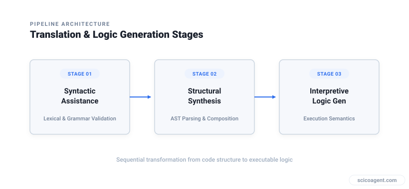
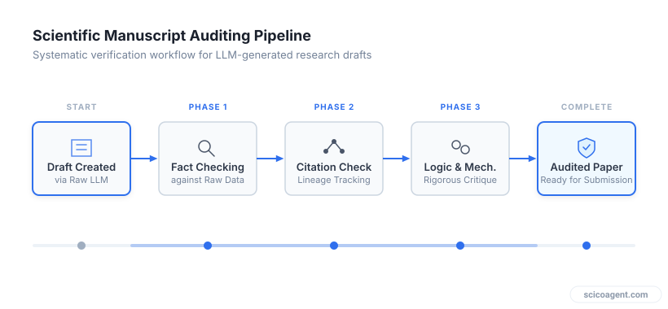

<div class="tldr" style="border:1px solid #e2e8f0;border-left:4px solid #2f6fed;background:#f8fafc;border-radius:10px;padding:16px 20px 14px;margin:0 0 30px;"><p style="margin:0 0 8px;font-weight:700;font-size:.8em;letter-spacing:.08em;text-transform:uppercase;color:#2f6fed;">In brief</p><ul style="margin:0;padding-left:20px;"><li style="margin:6px 0;line-height:1.5;">Rapid adoption of LLMs in manuscript preparation has outpaced established institutional oversight</li><li style="margin:6px 0;line-height:1.5;">Disclosures declaring full manuscript generation fail to specify functional contributions, data lineage, or error verification</li><li style="margin:6px 0;line-height:1.5;">Implementing a structured risk-tiered audit framework ensures transparency, reproducibility, and scientific integrity</li></ul></div>

How to systematically evaluate, document, and disclose Large Language Model usage in scientific manuscripts.

Academic researchers are witnessing a shift across peer-reviewed literature. Statements such as "This manuscript was mostly written through the usage of ChatGPT" are moving from rare anomalies to standard author notes. While adoption has accelerated, oversight and standardized protocols for evaluating machine-generated text have lagged behind. 

When AI systems move into decisions and workflows that carry significant weight, the absence of clear standards creates uncertainty regarding authorship, data integrity, and accountability. To maintain rigor, research teams require a practical method to audit, document, and disclose the exact contribution of Large Language Models (LLMs) in their publishing pipeline.

## A Functional Taxonomy of Machine Assistance

Vague declarations of AI usage fail to inform reviewers and readers about what the model actually performed. Writing a code snippet to format a plot carries vastly different risk profiles than generating a discussion section or synthesizing background literature. 

To evaluate risk accurately, LLM tasks in manuscript preparation can be divided into three discrete functional categories:

1. **Syntactic Assistance:** Grammar correction, language translation, formatting, and stylistic rephrasing without altering domain concepts.
2. **Structural Synthesis:** Summarizing literature, drafting boilerplate methodology descriptions from user specs, or generating initial manuscript outlines.
3. **Interpretive Logic Generation:** Synthesizing novel hypotheses, drafting interpretations of data, or inferring mechanisms from experimental results.


*Increasing risk profile across functional categories of LLM manuscript assistance.*

Each increase in functional autonomy shifts responsibility from formatting to core intellectual contribution. Treating all LLM assistance as a single category obscures the boundary between simple editing tools and intellectual contribution.

## Comparison of LLM Integration Levels

The table below outlines the risk exposure, required verification steps, and disclosure requirements across common execution levels in paper writing.

| Usage Tier | Operational Task | Primary Risk Factor | Required Verification Method | Recommended Disclosure |
| :--- | :--- | :--- | :--- | :--- |
| **Tier 1: Formatting** | Grammar polish, spellchecking, text formatting | Unintended alteration of domain-specific tone or terminology | Manual line-by-line proofread by domain expert | Standard acknowledgment or non-essential |
| **Tier 2: Draft Synthesis** | Literature summarization, method text generation | Citation hallucination, omission of critical edge conditions | Primary source verification for every cited claim | Detailed Methods or Ethics declaration section |
| **Tier 3: Reasoning** | Result interpretation, mechanistic deduction | Logical fallacies, plausible but incorrect scientific assertions | Full independent replication of reasoning and logic | Explicit section-level declaration and audit log |

## The Three-Tier Audit Framework

To implement a reproducible workflow before submission, research groups should establish an internal verification protocol. This framework operates through a decision sequence designed to isolate machine logic from verified scientific facts.


*Decision path for validating LLM-generated sections before manuscript submission.*

### Step 1: Fact and Data Lineage Verification

Any section containing data interpretation or numerical claims must be checked directly against primary sources and raw data repositories. LLMs generate text based on probabilistic token prediction rather than database lookup. Consequently, statements that sound authoritative can contain subtle numerical errors or invented references. Every citation introduced by a model must be manually retrieved and read to confirm it supports the exact assertion made.

### Step 2: Logical Consistency and Hallucination Auditing

Models often generate logical steps that sound coherent but violate physical or domain principles. Authors must audit the reasoning chain:
* Identify every assumption made in the machine-generated text.
* Check whether intermediate steps rely on unstated, unverified assumptions.
* Confirm that causal statements reflect validated mechanisms rather than mere co-occurrence in training data.

### Step 3: Generating an Auditable Prompt and Verification Log

To ensure transparency, researchers should maintain a simple verification log alongside their project files. This log records the model version, the exact prompt, the output received, and the manual verification actions taken by the authors.

```
[LLM AUDIT LOG ENTRY]
Date: 2026-03-30
Model: LLM Engine v4.2
Target Section: Methods (Paragraph 2)
Input Prompt: "Format the attached raw protocol steps into past-passive narrative prose."
Model Output ID: doc_78193
Verification Steps:
 1. Confirmed temperature settings match protocol log (22°C).
 2. Verified centrifuge speed corrected from model's output of 10,000 g to actual 1,000 g.
Human Auditor: Lead Researcher (Author 2)
Status: Verified and corrected.
```

## The Accountability Shift

A common misconception is that declaring broad LLM usage in a manuscript releases the author from responsibility for errors within the text. In practice, the opposite is true.

When authors declare that a manuscript was generated primarily by an LLM, they are not delegating responsibility to the software. Because an algorithm cannot hold legal or academic liability, the human authors accept absolute responsibility for every statement, citation, and logical step produced by the software. 

The true shift in modern scientific writing is not that text generation is becoming automated, but that the primary workload of the researcher is transitioning from prose writer to rigorous auditor. The declaration of machine usage does not mark the end of the review process, it marks the exact point where scientific auditing begins.
