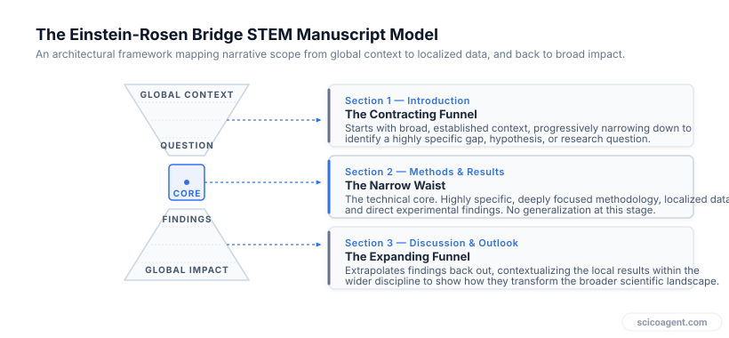
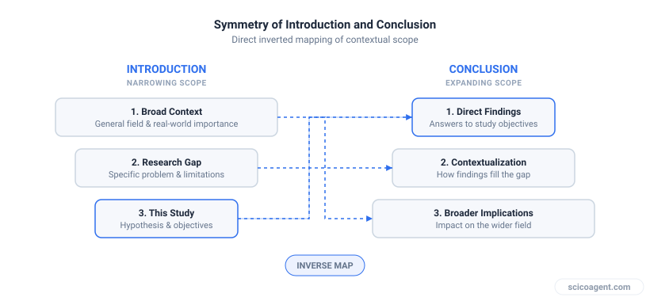

In brief
<ul style="margin:0;padding-left:20px;"><li style="margin:6px 0;line-height:1.5;">The introduction must act as a contracting funnel, moving from a broad field-level context to a highly specific knowledge gap and hypothesis.</li><li style="margin:6px 0;line-height:1.5;">The methods and results sections form the narrow throat of the manuscript, stripped of speculative interpretation and focused entirely on the localized experiment.</li><li style="margin:6px 0;line-height:1.5;">The discussion and conclusion function as an expanding funnel, mirroring the introduction by translating specific data back into global field implications.</li><li style="margin:6px 0;line-height:1.5;">The top and bottom of the hourglass must structurally align, ensuring that the future outlook directly addresses the broad problem introduced in the opening paragraphs.</li></ul>

An elegant scientific paper does not just report data; it guides the reader through a precise cognitive transition. This transition is best understood as an Einstein-Rosen bridge, which is a wormhole connecting two separate regions of spacetime. In this structural model, your paper begins in the broad, established landscape of your field, narrows down through a tight bottleneck of highly specific methodology, and then expands back out to transform the broader scientific landscape.

Mastering this STEM manuscript writing style is the key to writing papers that are both highly readable and conceptually robust. 

## The Architecture of the Hourglass

To understand how to execute this layout, it is helpful to visualize the paper as a physical hourglass. The top half is your introduction, which functions as a contracting funnel. The bottom half is your discussion and conclusion, which functions as an expanding funnel. The narrow neck in the middle contains your methods and results.

*The Einstein-Rosen Bridge structural model for STEM papers.*

Many manuscript rejections occur because of a structural mismatch between these sections. Authors often write introductions that are too narrow, leaving the reader wondering why the work matters. Conversely, authors often write conclusions that fail to return to the broader context, leaving the reader with a pile of isolated data points but no clear understanding of how the field has changed as a result of the study.

---

## Constructing the Top Funnel: The Introduction

The goal of your introduction is to lead a diverse audience of scientists from a shared, uncontested starting point down to the exact, highly technical question your study answers. This requires a three-stage funneling process.

### 1. The Global Context (Broad)
Start with the overarching state of the field. What is the grand challenge or established paradigm? This section should use language accessible to any scientist working in your general discipline, not just your narrow sub-field.

### 2. The Knowledge Gap (Intermediate)
Narrow the focus by introducing the limitation of current knowledge. What is the unresolved contradiction, the missing mechanism, or the computational bottleneck? This is the pivot point where you justify the existence of your study.

### 3. The Specific Statement of Purpose (Narrow)
At the bottom of the funnel, state exactly what you did, what you measured, and what you hypothesized. This is the narrowest point of the introduction, and it directly interfaces with your methods.

---

## The Empirical Throat: Methods and Results

At the center of the Einstein-Rosen bridge lies the throat, which is the most localized, highly technical part of your manuscript. Here, the STEM manuscript writing style demands absolute specificity and the complete absence of speculative interpretation. 

In this section, you are not trying to convince the reader of the global importance of your work. Instead, you are presenting the raw, objective reality of your experimental design and data. You must describe your protocols, specify your control variables, and present your statistical analyses with enough granularity that another researcher could replicate your exact steps.

---

## Constructing the Bottom Funnel: Discussion and Conclusion

The discussion and conclusion must perform the exact inverse operation of your introduction. You begin at the narrowest point, which is your specific results, and gradually expand your scope until you are once again speaking to the entire field.

*Direct mapping of the introduction stages to the conclusion stages.*

To achieve this symmetry, your discussion should follow a three-stage expansion that mirrors your introduction.

| Introduction Stage (Downward Funnel) | Aligned Conclusion Stage (Upward Funnel) |
| :--- | :--- |
| **Hypothesis & Objectives:** The specific, localized question your experiment was designed to answer. | **Specific Findings:** Direct answers to the hypothesis, supported by your newly acquired data. |
| **The Knowledge Gap:** The specific limitation in the existing literature that you identified. | **Field Integration:** How your findings fill that gap, and how they agree or disagree with previous models. |
| **Global Context:** The overarching scientific landscape and grand challenges of your discipline. | **Future Outlook:** The broader implications of your work, including new research avenues and practical applications. |

---

## A Worked Example of Structural Alignment

To see this STEM manuscript writing style in practice, consider a study investigating a new anode material for sodium-ion batteries. Notice how the introduction narrows down, while the conclusion mirrors that trajectory in reverse.

### The Introduction Funnel
*   **Global Context:** Transitioning to renewable energy requires grid-scale energy storage solutions that do not rely on scarce resources like lithium.
*   **Knowledge Gap:** Sodium-ion batteries are a promising alternative, but current hard-carbon anodes suffer from rapid capacity decay over extended cycling due to volume expansion.
*   **Specific Hypothesis:** We hypothesize that doping hard-carbon anodes with nitrogen will create structural defects that accommodate volume expansion, thereby stabilizing capacity over 1,000 cycles.

### The Conclusion Funnel
*   **Specific Finding:** Our results demonstrate that the nitrogen-doped anodes retained 89 percent of their initial capacity after 1,000 cycles, showing minimal structural degradation under electron microscopy.
*   **Field Integration:** By resolving the volume expansion issue, this doping strategy addresses the key limitation identified in previous studies of hard-carbon anodes, offering a viable pathway to stable sodium-ion chemistry.
*   **Future Outlook:** This material design framework can be extended to other alkaline-earth metal batteries, accelerating the development of abundant, low-cost grid storage systems globally.

---

## The Boundary Condition Reversal

We often think of the broad sections of our papers, such as the global context and the future outlook, as mere decorative framing. We treat them as necessary packaging to satisfy journal editors or to make our highly specialized work seem more palatable to the public. 

But this view misses the true mathematical and logical function of the funnel structure. 

The broad funnels are not marketing. They are the boundary conditions that define the physical validity of your entire study. Just as a differential equation cannot be solved without its boundary conditions, your specific empirical results have no objective meaning without the conceptual boundaries established in your introduction and conclusion. 

If your introduction defines the boundaries of the problem too loosely, your narrow results will fail to resolve the equation you set up. If you define them too tightly, you are solving a trivial equation that has no impact on the surrounding universe. The real art of the STEM manuscript writing style is not just in executing the experiments at the narrow throat of the bridge, but in ensuring that the entry and exit funnels are perfectly aligned, mathematically and conceptually, with the scale of the science you have actually done.
