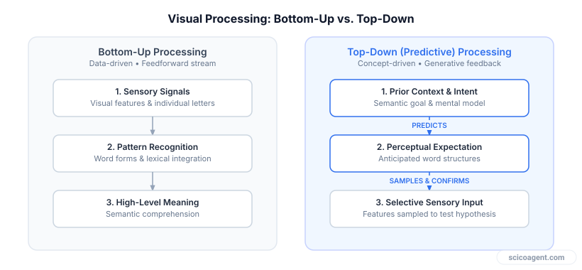
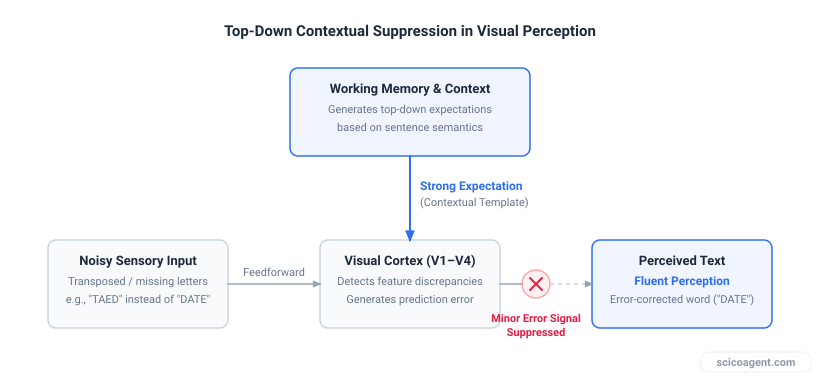
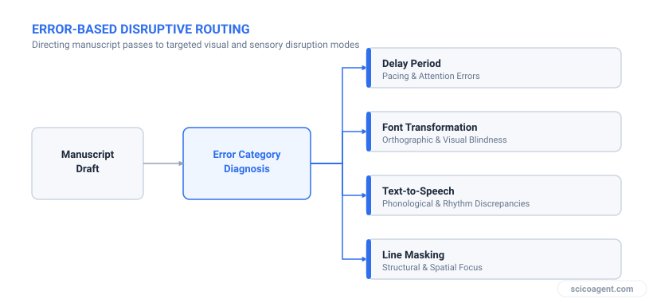

In brief
<ul style="margin:0;padding-left:20px;"><li style="margin:6px 0;line-height:1.5;">Top-down visual processing prioritizes high-level semantic context over raw sensory inputs, leading the visual cortex to reconstruct expected text rather than parse printed characters.</li><li style="margin:6px 0;line-height:1.5;">Predictive coding minimizes cognitive energy consumption by using existing mental models of your manuscript to actively suppress sensory discrepancy signals.</li><li style="margin:6px 0;line-height:1.5;">The inability to catch errors in your own writing is a direct consequence of familiarity, which shifts reading mechanics from bottom-up sensory analysis to top-down confirmation.</li><li style="margin:6px 0;line-height:1.5;">Effective self-proofing requires artificial disruption protocols that change the visual presentation and force the visual system back into bottom-up processing modes.</li></ul>

Understanding top-down visual processing and predictive coding reveals why you are neurologically blind to typos in your own research manuscripts, and how to restructure your workflow to bypass your brain's cognitive shortcuts.

If you have ever submitted a manuscript to co-authors only to spot a glaring error on the title page minutes later, you have experienced why your brain is the worst proofreader for your own work. The phenomenon is universal across academic disciplines, affecting novice graduate students and seasoned principal investigators alike. It is not a symptom of carelessness, exhaustion, or poor training. It is the direct output of an extraordinarily efficient perceptual system operating exactly as it evolved to do.

To write effectively, you rely on high-level cognitive abstraction. But when you switch tasks to proofread, that same cognitive architecture actively hinders your performance. Understanding the neuroscience behind this shift clarifies why traditional advice like "read more carefully" inevitably fails, and what specific mechanical interventions can override your brain's predictive machinery.

## Predictive Coding and Top-Down Visual Processing

When you look at a page of text, you might assume your eyes act like a camera, capturing raw visual pixels and transmitting them to the visual cortex for objective rendering. Visual neuroscience demonstrates that reading works in the opposite direction. 

Human visual processing operates via a continuous feedback loop between bottom-up sensory input (light signals hitting the retina) and top-down predictive models generated by higher cortical areas. Sensory processing is computationally expensive. To conserve metabolic energy, the brain functions as a predictive coding engine. Instead of processing every incoming visual feature from scratch, higher cortical regions construct a generative model of what they expect to see based on prior context, grammar, and semantic intent. 

*Visual processing flips from sensory-driven parsing to context-driven prediction when reading familiar text.*

During normal reading, your eyes do not glide smoothly across lines of text. They execute rapid, jerky movements called saccades, pausing briefly at specific locations during fixations. Foveal vision, which provides high-resolution visual acuity, covers only a narrow band of roughly two degrees of visual arc, or about four to eight letters at a standard viewing distance. The surrounding parafoveal vision perceives word lengths, space boundaries, and coarse character shapes, feeding this partial data into the brain's predictive model.

If the incoming sensory signals loosely match the predicted model, the brain suppresses the sensory discrepancy and registers the word as correct. You do not see what is actually printed on the page; you perceive the brain's internal prediction of what ought to be there.

## Why Your Brain Is the Worst Proofreader of Your Own Writing

The reason you easily catch typographical errors in a colleague's draft but consistently miss them in your own comes down to the depth of your internal mental model. 

When reading unfamiliar text, your brain lacks a robust prior model of the precise sentence structure, vocabulary, and logical trajectory. Consequently, it must rely heavily on bottom-up sensory inputs to build meaning. Prediction error signals are frequent, forcing the visual cortex to inspect the raw visual details of each word.

When reading your own manuscript, the internal model is deeply established. Working memory already contains the conceptual framework, the sentence flow, and the precise words you intended to write. As your eyes perform saccades across the page, your brain uses minimal visual data to confirm its existing predictions.

*Established internal models suppress visual mismatch signals before they reach conscious awareness.*

This mechanism explains several ubiquitous proofreading failures:

1. **Transposition and Typoglycemia**: The brain parses words primarily by their first letter, last letter, and overall outline shape (or bouma). If the constituent letters are present, top-down processing reconstructs the correct word automatically.
2. **Missing or Duplicated Words**: High-frequency function words (such as "the", "in", or "of") are rarely fixated directly by the fovea. The brain predicts their presence based on syntax and skips over visual omissions or double prints like "in the the context".
3. **Homophone Substitutions**: Because the phonological loop in working memory recites the intended word (e.g., "their"), visual inputs for a homophone (e.g., "there") are frequently overridden by semantic expectation.

The more familiar you are with a piece of writing, the less visual information your brain requires to process it. Consequently, familiarity directly decreases proofreading accuracy.

## Practical Strategies to Hack Your Cognitive Hardware

Because you cannot consciously command your visual cortex to disable top-down predictive processing, effective self-proofing requires structural interventions. The objective is to disrupt your internal model and force your visual system back into bottom-up processing mode.

The following protocols alter the visual presentation or sensory channel, preventing the brain from relying on pre-existing conceptual expectations:

| Proofreading Intervention | Primary Mechanism | Targeted Error Class |
| :--- | :--- | :--- |
| **Format & Font Disruption** | Destroys recognized word-shape profiles and line-wrap positions, forcing new fixations. | Transpositions, visual typos, layout anomalies. |
| **Auditory Playback (Text-to-Speech)** | Reroutes input through the auditory cortex, bypassing visual expectation channels. | Omitted words, awkward syntax, duplicate words. |
| **Reverse Sentence Parsing** | Isolates sentences from narrative flow, disabling semantic prediction models. | Grammatical errors, local logic breaks, punctuation. |
| **Physical Line Masking** | Prevents parafoveal preview of upcoming text, forcing strict foveal focus. | Skipped words, trailing sentence errors. |

### Worked Protocol: Implementing Visual and Temporal Disruption

To maximize error detection prior to journal submission, structure your review process into distinct visual passes rather than a single uninterrupted reading session:

*Sequenced proofreading stages designed to systematically break predictive visual bias.*

1. **Enforce a Cognitive Delay Period**: Allow at least 24 to 48 hours between drafting and final proofreading. This permits working memory activation levels regarding specific phrasing to decay, weakening the top-down predictive model.
2. **Transform Visual Presentation**: Change the document font to a unfamiliar typeface (such as a monospaced font like Courier), increase font size to 14pt, and expand line spacing. This alters word shapes, breaks established visual chunking, and shifts line-wrap locations.
3. **Isolate Local Context**: Read the document backward, sentence by sentence, starting from the conclusion and moving to the introduction. This completely eliminates narrative momentum, preventing high-level semantic priming from overriding syntax-level errors.
4. **Offload to Auditory Processing**: Use synthetic text-to-speech software to read the text aloud while your eyes follow the printed word. The auditory cortex processes temporal sequential input without the visual system's capacity for spatial skipping, instantly exposing missing words, unintended repetitions, and mismatched subject-verb agreements.

## The Evolutionary Trade-off in Scientific Thought

It is tempting to view top-down visual bias as a flaw in human cognition, a frustrating limitation that leads to embarrassing errata in published literature. Yet this view misses the fundamental trade-off that enables advanced analytical thought.

Proofreading fails not because the human brain is an inefficient sensory processor, but because it is an exceptionally optimized prediction machine. The visual cortex prioritizes semantic abstraction over literal visual sensory fidelity. 

If your visual system processed every printed letter with equal, unguided bottom-up attention, reading a single journal article would require immense cognitive effort. You would spend so much working memory capacity parsing low-level visual features that you would struggle to synthesize complex conceptual arguments, evaluate methodological validity, or track multi-step mathematical proofs across a paper.

The precise neurobiological mechanism that makes your brain a terrible proofreader, its relentless drive to ignore visual details in favor of higher-level meaning, is the exact capability that allows you to engage in high-level scientific reasoning in the first place. Your typos are not evidence of a cognitive failure; they are the necessary cost of a brain designed to think in ideas rather than pixels.

## A reader that doesn't share your blind spots

All of this is why a second set of eyes has always been the fix, and why a good
one is so hard to come by. A co-author's attention is scarce, and by the time a
manuscript is due, everyone on it has read the thing so many times that they have
gone blind to it too. That is the gap [Benjamin](https://benjamin.scicoagent.com)
is built to close. It reads your manuscript the way this article says you cannot
read your own: fresh every time, with no memory of what you meant to write.

What makes it useful for scientists in particular is that it does not stop at
spelling. It checks units, notation, and equations in context, so a stray
exponent, a mismatched unit, or a flipped sign gets flagged instead of sailing
through to a reviewer. It works on the files you actually submit (LaTeX, Word,
Markdown, and RTF) and returns real tracked changes, either native Word Track
Changes or an inline LaTeX diff, so you accept or reject every edit yourself.
Nothing is rewritten behind your back, and it reads in 95+ languages if English
is not your first.

It will not promise you an acceptance, and it is no substitute for peer review or
your own judgment. What it does is catch the small, expensive errors your brain is
wired to skip, before someone else does. Sign in with Google and run a manuscript
through it: [benjamin.scicoagent.com](https://benjamin.scicoagent.com).
