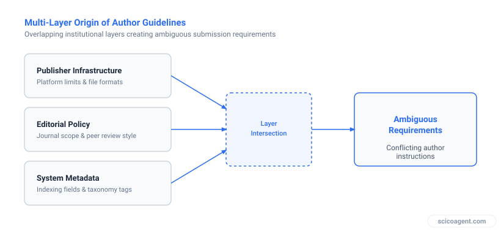
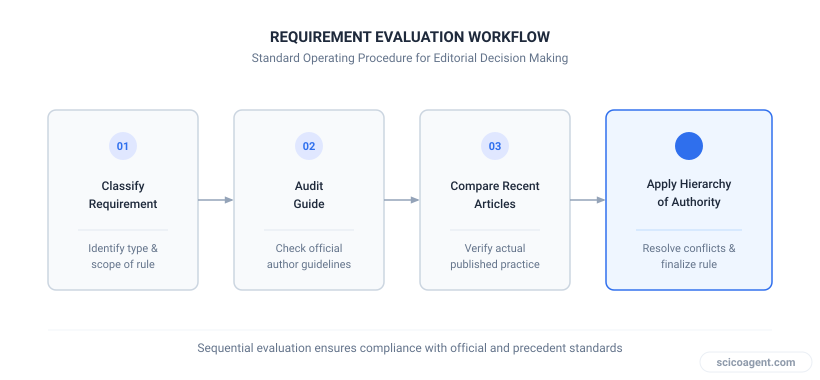
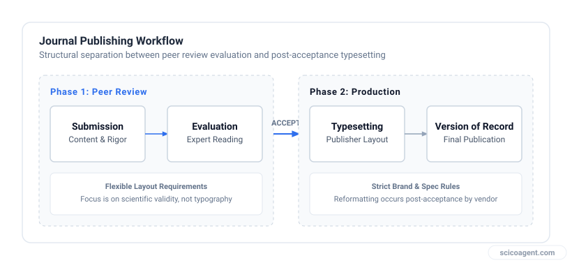

In brief
<ul style="margin:0;padding-left:20px;"><li style="margin:6px 0;line-height:1.5;">Manuscript submission guidelines frequently contain contradictory instructions due to decoupled editorial and production workflows.</li><li style="margin:6px 0;line-height:1.5;">Resolving guideline ambiguities requires separating hard desk-rejection criteria from flexible formatting conventions.</li><li style="margin:6px 0;line-height:1.5;">When guidelines conflict, published articles from the target journal's most recent issue serve as the empirical baseline.</li></ul>

### A systematic methodology for resolving ambiguous submission requirements, conflicting rules, and editorial edge cases.

When preparing a manuscript for submission, deciphering a journal guide for authors often feels like trying to parse an incomplete specification. A researcher preparing a manuscript for a journal like *Expert Systems with Applications* (ESWA) reads the official instructions, only to find critical gaps: conflicting word limits across different pages of the publisher portal, unclear rules regarding figure placement in the main text versus separate files, or contradictory guidance on author anonymity during double-blind review.

This ambiguity is not an isolated oversight. It is a structural feature of academic publishing. Understanding why guidelines fail, how to triage conflicting instructions, and how to verify compliance using published artifacts eliminates submission friction without wasting time on unnecessary reformatting.

---

## Why the Journal Guide for Authors Is Inherently Ambiguous

To resolve ambiguities in author instructions, one must first understand how journal guidelines are created and maintained. A typical journal guide for authors is not a single unified document written by the current editorial board. Instead, it is an administrative hybrid assembled from three distinct sources that often operate in isolation:

1. **Publisher-Level Infrastructure:** The commercial publisher (such as Elsevier, Springer Nature, or IEEE) maintains global technical rules for font rendering, figure resolution, reference tagging, and automated text ingestion.
2. **Journal-Level Editorial Policy:** The Editor-in-Chief and associate editors establish content scope, word count limits, mandatory section structures, and specific reporting standards relevant to their subfield.
3. **Legacy Ingestion Systems:** Older submission management system interfaces retain legacy validation logic that may not match updated author guidelines.

*Structural architecture of journal submission rules.*

When an editorial board updates its review policies, it rarely rewrites the publisher's global technical template. Consequently, authors encounter system requirements that conflict directly with editorial text. For example, the text instructions may specify double-blind peer review requiring complete anonymization, while the online submission portal mandates a cover page containing author affiliations attached to the primary text file.

---

## A Systematic Framework for Resolving Guideline Conflicts

When a journal guide for authors yields ambiguous or conflicting directions, relying solely on administrative help desks can introduce delays measured in weeks. Authors can systematically resolve ambiguities by categorizing requirements into two functional classes: **Hard Structural Barriers** and **Soft Production Preferences**.

| Constraint Category | Examples | Primary Risk | Empirical Verification Source |
| :--- | :--- | :--- | :--- |
| **Hard Structural Barriers** | Anonymization rules, manuscript word caps, explicit section order, missing compliance statements | Immediate desk rejection by managing editor | Published Guide for Authors (text version) |
| **Soft Production Preferences** | Citation style variants, line spacing, image file extensions, sub-heading numbering | Minor administrative query or post-acceptance reformatting | Recent published articles in target journal |

### Step 1: Identify Desk Rejection Triggers

Managing editors screen submissions before peer review to ensure basic compliance. These screening checks focus almost entirely on operational rules that affect peer review integrity or domain fit:

* **Review Anonymity:** If the journal uses double-blind review, any author identity in the primary text or file metadata triggers immediate return or rejection.
* **Over-length Submissions:** Exceeding word limits by substantial margins flags automated filters.
* **Missing Ethical / Mandatory Sections:** Declarations of interest, data availability statements, or ethical committee approvals are required by policy.

### Step 2: Use Published Articles as Empirical Baselines

When the written guide is silent or contradictory on formatting details (such as whether tables belong inside the text or at the end of the manuscript), the most recent published volume of the target journal provides the empirical ground truth. 

Publishing production teams enforce standardized layout structures during typeset operations. If every article published in the last three months displays inline figures and a specific section numbering scheme, that structure reflects the actual operational output of the journal, regardless of vague wording in the online guide.

*Decision process for resolving guideline contradictions.*

---

## Navigating Specific Submission Dilemmas

### 1. The Double-Blind Anonymization Dilemma
A frequent point of confusion occurs when a guide mandates double-blind review, but the submission portal requires an title page including author details. 

* **Mechanism:** The submission portal generates a combined review PDF for referees while storing original metadata separately.
* **Resolution:** Omit author names, affiliations, acknowledgments, and grant numbers from the main manuscript document file. Provide title, authors, and funding details solely in the designated title page file or portal metadata fields, unless the guide explicitly instructs otherwise.

### 2. Embedded Figures vs. Separate Image Files
Guidelines often state that figures must be uploaded as high-resolution EPS or TIFF files, while simultaneously requesting that figures be placed near their first mention in the text.

* **Mechanism:** Reviewers require figures in context for readable evaluation, whereas production typesetters require raw vector or raster files for typesetting.
* **Resolution:** Embed clear, labelled figures within the main body text immediately following their reference paragraph for the review PDF, and upload the high-resolution vector or raster files as separate supporting files during submission.

### 3. Word Count Boundary Conditions
Does the word count include references, figure captions, and abstract text?

* **Mechanism:** Portal text-parsers count every string in the main manuscript document file, whereas editorial policies usually judge substantive main-text length.
* **Resolution:** If the manuscript word count is near the strict upper limit, calculate main-text word count (excluding abstract, references, and table captions). If the automated portal rejects the file due to total word count, move large references or extended data tables into Supplementary Material.

---

## Scope and Limitations of the Framework

This pragmatic approach to interpreting a journal guide for authors is designed for peer-reviewed journal submissions in science, technology, engineering, and medicine (STEM). It relies on the structural distinction between editorial evaluation and post-acceptance production.

This framework does not apply to:
* **Conference Camera-Ready Submissions:** Proceedings with strict page-budget limits (such as IEEE or ACM conference publications) require strict layout fidelity before submission, as post-acceptance reformatting does not occur.
* **Monographs and Book Chapters:** Publisher guidelines for books govern final layout directly and carry strict design dependencies.

---

## The Structural Reality of Journal Guidelines

Researchers naturally treat a journal guide for authors as an author-facing instruction manual. When a manual contains ambiguous or contradictory instructions, the natural response is to assume that submission error will lead directly to rejection.

However, examining the technical workflow reveals a different reality:

*Separation of peer review and production pipelines.*

The journal guide for authors is not an instruction manual for authors. It is a legal and operational buffer designed to protect two entirely separate entities: the peer-review process and the automated typesetting pipeline.

The peer-review process requires only readability, anonymization, and scientific integrity. The automated typesetting pipeline requires standardized metadata, clean citations, and high-resolution assets. Because peer review occurs long before typesetting, editors routinely accept papers that deviate from minor production formatting, provided the scientific content and review integrity remain intact. 

The structural ambiguity authors experience is not a sign that submission is a minefield. It is proof that peer review operates independently of post-acceptance layout rules. Focusing strictly on review integrity and core structural limits ensures smooth processing through the submission portal without wasting research time on cosmetic compliance.
