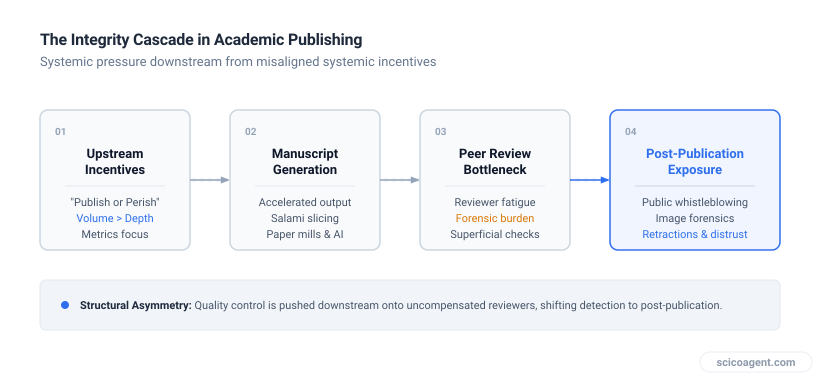
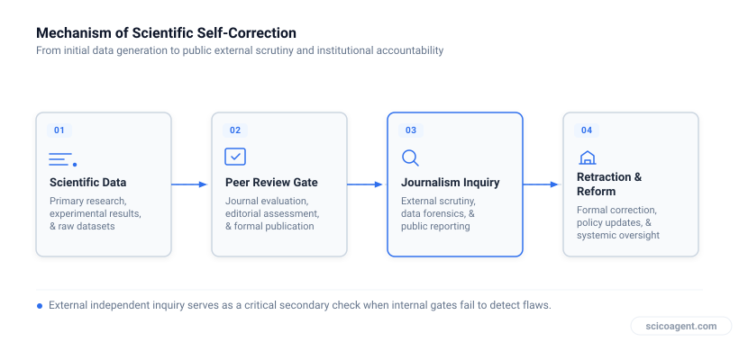

In brief
<ul style="margin:0;padding-left:20px;"><li style="margin:6px 0;line-height:1.5;">Downstream peer review cannot substitute for upstream structural controls on plagiarism and research integrity</li><li style="margin:6px 0;line-height:1.5;">Mental health support focused exclusively on individual counseling ignores systemic curriculum and workload flaws</li><li style="margin:6px 0;line-height:1.5;">External journalism succeeds in exposing bad science precisely where internal academic peer review mechanisms encounter structural friction</li></ul>

## Why treating academic plagiarism and researcher burnout as individual moral failures misses the structural mechanisms driving both.

You open an invitation to review a newly submitted manuscript, scan the abstract, and hit a wall of cognitive dissonance. The framework is familiar. The argument is identical to your own. In fact, entire sentences are lifted directly from your published papers, reassembled into a manuscript under someone else's name.

This moment is more than a personal insult or an isolated breach of research ethics. It is a diagnostic signal of a system attempting to solve structural problems at the wrong end of the pipeline. Academic staff and researchers face systemic frustrations regarding mental health support, plagiarism, and the integrity of the scientific process. The standard response to all three is to place the burden of remediation onto the individual.

## The Downstream Trap in Academic Ethics

When plagiarism reaches a peer reviewer, the institutional system has already failed twice. It failed to cultivate an environment where original synthesis is valued over publication velocity, and it failed to implement basic presubmission verification.

Peer review was designed to evaluate theoretical soundness, experimental design, and contextual relevance. It was never structured to serve as an uncompensated, forensic plagiarism detection service for overburdened researchers. Yet, when plagiarized manuscripts slip through, the narrative focuses on reviewer vigilance rather than the incentives that generate copy and paste scholarship.

*The shift of structural burden in academic publishing*

By treating plagiarism as an isolated moral lapse to be caught at the review stage, institutions ignore pipeline dynamics. Researchers operate under output quotas that reward paper count over conceptual depth. When publication volume becomes the primary currency of career survival, text reuse and derivative claims become predictable system outputs rather than unexpected anomalies.

## The Parallel in Academic Mental Health Support

This reliance on downstream remediation is not unique to peer review. It defines how universities approach mental health support for students and junior academic staff.

When student distress rises, institutional responses almost universally focus on expanding counseling services, wellness workshops, and mindfulness applications. While individual support is necessary, it treats the symptom while leaving the cause untouched. Is student mental health support too focused on counseling and not enough on curriculum design?

Consider the structural drivers of academic strain: hyper compressed assessment schedules, redundant coursework demands, ambiguous evaluation criteria, and precarious employment conditions for early career researchers. Offering counseling to a graduate student facing an unmanageable curriculum is the analytical equivalent of assigning a peer reviewer to catch verbatim plagiarism. Both approaches attempt to absorb structural damage at the terminal point of impact rather than fixing the design upstream.

| Domain | Downstream Remediation (Status Quo) | Upstream Structural Design |
| :--- | :--- | :--- |
| **Academic Integrity** | Relying on volunteer peer reviewers to spot stolen text and duplicate claims | Structuring institutional evaluation around work quality rather than publication velocity |
| **Mental Health & Support** | Expanding individual counseling sessions and crisis lines for overwhelmed staff | Reengineering curriculum design, assessment schedules, and labor expectations |
| **Scientific Validation** | Expecting self correction through post hoc voluntary retractions | Utilizing transparent open data requirements and external investigative scrutiny |

When institutions prioritize downstream care over upstream reform, they shift the responsibility for structural friction onto the person experiencing it. A well designed curriculum reduces chronic anxiety by establishing clear expectations and realistic workloads. Downstream counseling simply helps individuals tolerate poorly designed environments for a little longer.

## Why Journalism Exposes What Peer Review Misses

The structural failure of internal academic gatekeeping explains why external interventions have become so prominent. Journalism can help expose bad science and trigger real-world change in ways that formal academic channels frequently fail to match.

*Investigative journalism as an external verification loop in science*

Investigative reporting does not succeed because journalists possess superior domain expertise compared to peer reviewers. It succeeds because journalists operate under a completely different incentive structure and possess distinct operational tools:

1. Freedom from institutional conflicts of interest that disincentivize whistleblowing within specialized departments.
2. Investigative timelines unconstrained by unpaid two week review deadlines.
3. Direct communication mechanisms that bypass institutional legal departments designed to shield universities from reputational risk.

When journalists expose fabricated data or systemic paper mill operations, it highlights a fundamental reality: internal peer review is a validation step for valid work, not a fraud detection department. Expecting peer review to police bad science without structural reform is an exercise in misplaced reliance.

## Refusing the Forensics Burden

Navigating ethics and support in academia requires recognizing that research integrity and researcher wellbeing are not separate domains. They are two expressions of the same underlying architecture.

When you encounter a manuscript that copies your own language and arguments, the instinct is to treat it as a personal dispute or a failure of editorial software. The broader reality is that the author was incentivized to produce low effort output, the journal was incentivized to process volume, and you were expected to provide free forensic auditing to maintain the illusion of quality control.

The solution to bad science and pervasive academic burnout will not come from asking peer reviewers to be better detectives, nor will it come from offering stress management webinars to overworked researchers. It requires demanding that academic institutions fix their upstream design: aligning evaluation metrics with scientific rigor and structuring workloads so that survival does not require compromise.

Peer review was created to advance scientific dialogue among peers who assume mutual good faith. When a system relies on uncompensated reviewers to act as police officers and individual counseling to compensate for unsustainable workloads, it is not suffering from a lack of vigilance. It is operating a structural design that actively converts institutional pressure into individual strain.
