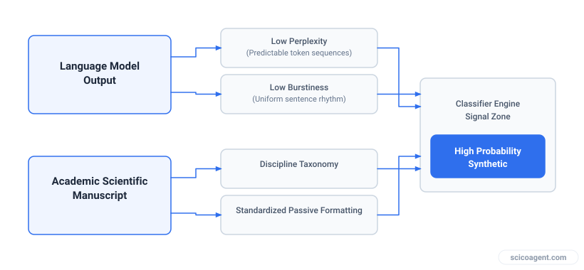
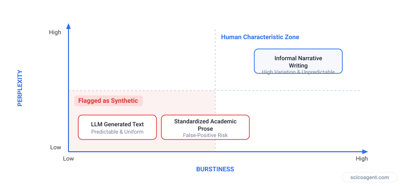

In brief
<ul style="margin:0;padding-left:20px;"><li style="margin:6px 0;line-height:1.5;">AI detectors do not measure machine intelligence or intent; they evaluate statistical metrics like perplexity and burstiness against reference language models.</li><li style="margin:6px 0;line-height:1.5;">Scientific papers naturally exhibit low perplexity due to discipline-specific vocabularies, standardized terminology, and rigid passive structures.</li><li style="margin:6px 0;line-height:1.5;">The editorial pursuit of clear, uniform, and concise prose reduces sentence-length variability, artificially lowering burstiness.</li><li style="margin:6px 0;line-height:1.5;">Automated AI detectors inadvertently penalize authors who adhere strictly to institutional scientific style guidelines.</li></ul>

How standardized syntax and clear academic formatting trigger false positive classifications in peer review.

A researcher spends six months conducting experiments, analyzing statistical output, and writing an original manuscript from scratch. Every paragraph, citation, and equation is drafted entirely by hand. Before submitting the paper to a journal, the author runs the document through an automated detection tool out of curiosity. The result is bewildering: the classifier flags forty percent of the manuscript as artificial, marking carefully crafted methodology sections as machine-generated text.

This scenario is far from isolated. On academic forums and across research networks, scientists regularly report that their original work is being flagged during submission. The immediate suspicion is often that these detection engines are simply broken or guessing randomly. 

The reality is more structural. Automated detectors operate on predictable mathematical principles. When we look at the underlying mechanics of statistical text analysis, a troubling relationship emerges: the specific stylistic constraints that make scientific writing clear, precise, and publishable are identical to the mathematical features that classifiers use to label text as machine-generated.

*Convergence of synthetic text metrics and formal academic prose conventions.*

## How Classifiers Work: Perplexity and Burstiness

To understand why AI detectors flag human written scientific writing, one must examine what these tools actually evaluate. Detectors do not search for logic, factual accuracy, or true understanding. They evaluate probabilistic patterns in character sequences using two main metrics: perplexity and burstiness.

Perplexity measures the unpredictability of a text relative to a reference language model. If a model can easily predict the next word in a sequence based on the preceding words, the perplexity score is low. Human writing across informal contexts typically displays high perplexity because human vocabulary choices are varied, idiosyncratic, and contextual. Large language models, by contrast, operate by selecting high-probability tokens to maintain coherence, producing streams of low-perplexity text.

Burstiness measures the variation in sentence structure, length, and complexity across a document. Human writers naturally vary their rhythm. They might follow a dense, forty-word compound sentence containing nested clauses with a sharp, five-word statement. This creates high variance in entropy across paragraphs. Machine outputs, optimized for consistent probability distribution, exhibit low burstiness. Their sentences tend to cluster around a uniform length, structural cadence, and rhythmic density.

When a detector evaluates a document, it maps these two features onto a decision space. Text characterized by low perplexity and low burstiness falls directly into the statistical zone flagged as artificial.

*Distribution of text types across perplexity and burstiness metrics.*

## Why AI Detectors Flag Human Written Scientific Writing: The Perplexity Trap

Scientific communication relies on standardized conventions. To communicate complex empirical findings clearly across global disciplines, academic writing discourages artistic flourish, unusual metaphors, and unpredictable syntax.

This creates an inherent tension when manuscripts are run through probabilistic classifiers.

| Stylistic Dimension | Academic Writing Guideline | Classifier Interpretation |
| :--- | :--- | :--- |
| **Vocabulary** | Use standardized, field-specific terminology (e.g., "statistically significant difference"). | **Low Perplexity**: Highly predictable token sequences based on domain training data. |
| **Sentence Length** | Maintain consistent, logical transitions to preserve cognitive clarity. | **Low Burstiness**: Uniform rhythmic structure across sequential paragraphs. |
| **Voice & Stance** | Use formal passive voice and objective, non-narrative phrasing. | **Low Entropy**: Absence of unexpected personal idioms or irregular syntactic shifts. |
| **Structure** | Follow rigid templates (Introduction, Methods, Results, Discussion). | **Predictable Pattern**: High probability of standard structural markers. |

Consider the methodology section of a biochemistry paper. Authors are trained to use precise, non-ambiguous phrases: "The samples were centrifuged at 10,000 g for 15 minutes at 4 degrees Celsius." 

To a language model trained on millions of scientific texts, this sentence is almost entirely predictable. Given the starting sequence "The samples were centrifuged at", the probability of the subsequent tokens approaches certainty within the domain context. Because the scientific discipline demands this exact phrasing for reproducibility, the prose yields an extremely low perplexity score. 

When an entire manuscript adheres strictly to these standards of clear, objective reporting, its overall statistical signature collapses into the precise profile of synthetic text.

## The Editorial Paradox: Clarity as a Risk Factor

The problem deepens when manuscripts undergo thorough editing. Style guides, institutional editors, and peer reviewers constantly push authors toward greater conciseness, consistent terminology, and streamlined sentence structures. 

Removing ambiguous modifiers, standardizing technical terms, and maintaining consistent paragraph structures are fundamental rules of good scientific communication. Yet each of these edits systematically strips out syntactic noise and irregularity.

By refining a manuscript to meet the highest standards of scientific editing, authors actively lower its perplexity and smooth out its burstiness. The process of making a paper clear, readable, and publishable is the exact process that moves its statistical footprint into the flag zone of automated detection classifiers.

Authors who write with inconsistent tone, non-standard grammar, or unconventional phrasing are often rewarded by detectors with a "human" score due to high perplexity. Conversely, non-native English speakers who rely on standard, memorized academic idioms to ensure grammatical correctness are particularly vulnerable to false positive flags. Their use of predictable phrasing generates the precise low-perplexity signal that triggers automated review flags.

## The Truthful Reframe: Why Detection Cannot Scale

The persistent failure of automated detection in scholarly publishing is not merely a software bug waiting for an algorithm update. It is a fundamental conflict between two opposing objectives.

Scientific publishing requires text to be predictable, standardized, and precise. Detection classifiers assume that predictable, standardized, and precise text is machine-generated.

As long as classifiers rely on statistical entropy to infer origin, they will continue to penalize the most disciplined scientific prose. The attempt to enforce academic integrity through probabilistic text metrics creates a structural paradox: the better a paper is edited for objective scientific clarity, the less human it appears to a mathematical detector.
