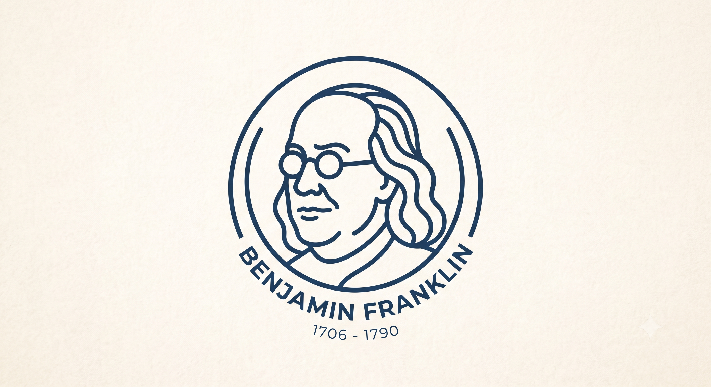

It is a little after two in the morning, and you have read your own paper so many times that your eyes have stopped landing on the words. They just slide across them. You run it through the grammar checker one more time, watch the last underline disappear, and see the small green checkmark that says everything is fine.

So you submit.

Three weeks later a reviewer's note comes back, circling Equation 7. A subscript that should have read $i < j$ instead reads $j \mid j \neq i$, which quietly counts every interaction twice. It had been sitting there the whole time, in a line you had personally stared at on a dozen different nights. Every tool you own had let it through, because none of them were reading the science. They were reading the spelling.

That is the strange thing about writing in science. In an email, a typo is a small embarrassment. In a paper, it can change what you actually said.

A roman "d" where an italic $d$ belongs turns a derivative into a stray variable. Drop the little ring off an Å and a careful bond length becomes nonsense. Miss a diacritic and Veličković becomes some other person named Velickovic who never wrote the paper you are citing. And a summation sign that slides under a fraction bar can flip the physics of a whole model with total confidence. That last one is not hypothetical. It lived in a heavily cited paper for years and, read literally, described [a universe that tears itself apart](/blog/posts/the-universe-eats-itself/). I wrote that one up on its own, if you ever want the full autopsy.

We started calling these SciTypos. They survive peer review for a plain reason. Everyone in the chain, the authors, the three reviewers, the copy-editor, the software, is quietly checking the same layer. The prose. Nobody is assigned to the math.

## Why I built him

Benjamin started as my own frustration, somewhere between the fourth revision of a paper and a thesis that kept refusing to write itself.

What I kept noticing was this. The only proofreader who ever caught the real errors was another scientist. Someone who could look at an equation and feel that something was off before they could even explain why. No grammar app does that. It will happily flag a passive sentence for you. It will never notice that your epsilon (ε) is impersonating an "element of" (∈) sign. For that you do not need better software. You need a colleague.

So I tried to build one. And I gave him a name, because "run it through the tool" never felt like the right sentence for the thing I actually wanted.

## Who Benjamin is

Benjamin is a perfectionist, in the good sense of the word. He reads the way the best senior collaborators read, the ones who go through your draft slowly with a pencil and find the one thing that would have cost you. He does not skim. He goes symbol by symbol, watching your units, your notation, your matrices, and the sign in front of every term.

He works in the formats scientists actually live in, so LaTeX, Word, plain text, and RTF are all fine by him. And he does not quietly rewrite your file behind your back. He hands it back the way a good co-author would, as a clean copy plus a full set of tracked changes you can read, argue with, accept, or throw out one line at a time. Nothing happens to your science without your say-so.

There is a reason he is called Benjamin, and it is not an accident of a name generator.

Long before he was a face on a banknote, Benjamin Franklin was a printer. He learned the trade at twelve, setting type by hand, letter by letter, backwards and upside down, catching the slips before a page ever reached the press. He stayed proud of it for the rest of his life. He signed himself "B. Franklin, Printer," and he wrote his own epitaph as if he were a book, one whose contents would appear again someday in a new edition, revised and corrected by the author. For Franklin, proofreading was not a chore he put up with. It was who he was.

And then there was the other half of him, the scientist. He flew a kite into a storm to coax lightning out of the sky, gave us words we still use every day for electricity, positive and negative, charge, battery, conductor, and won the Royal Society's highest medal for the trouble. One person, with a foot planted firmly in both of the worlds we care about here: the one who sets the type, and the one who understands what the type is trying to say.

He even built the glasses for the job. Bifocals were his invention, two lenses in a single frame, one for what sits close in your hand and one for what stands far across the room, so he never had to choose between the page and the world.

That whole dream is folded into our logo, if you look closely. It is a pair of Benjamin's spectacles. Through the left lens you find a plain "A", struck through. Through the right, the very same letter set right, as an "Å". One glass for the mistake, one glass for the fix, both worn by the same careful eye. We are simply trying to build a proofreader who reads your manuscript the way Franklin might have, as a printer and a scientist at once, looking through both lenses at the same time.

## What that looks like

Hand him the manuscript from the top of this story, and here is what comes back in the margin. The bare "A" put back to the "Å" it always was. Velickovic given his diacritics again. CO2 corrected to CO₂. And that runaway index in Equation 7 lifted out and rewritten as $i < j$, so nothing double counts and no universe collapses on submission day.

No fireworks. Just the specific, slightly obsessive corrections a careful colleague would have made, before a stranger ever got the chance.

## Before a reviewer does

Almost every scientist I know has some version of the two in the morning story. The one small comfort is that the second pair of eyes you always wanted at that hour does not get tired, and never needs the weekend off.

Give **[Benjamin](https://benjamin.scicoagent.com)** your next manuscript before a reviewer does, and let him read the science, not just the spelling.
