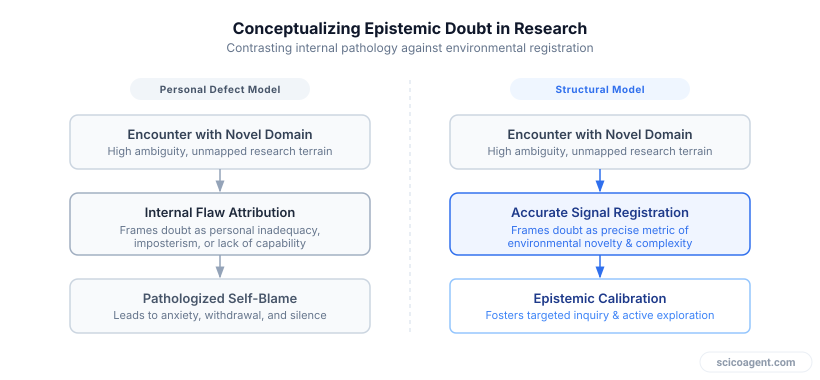
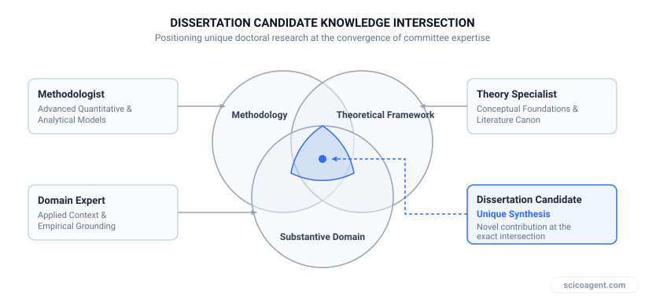

In brief
<ul style="margin:0;padding-left:20px;"><li style="margin:6px 0;line-height:1.5;">Imposter feelings in scientific research stem from the structural shift from mastering solved problems to operating at knowledge boundaries.</li><li style="margin:6px 0;line-height:1.5;">Institutional wellness models treat research anxiety as an internal defect rather than an accurate cognitive signal of novel problem solving.</li><li style="margin:6px 0;line-height:1.5;">Experiencing intellectual discomfort in seminars and viva defenses indicates calibration to frontier research rather than personal inadequacy.</li></ul>

### Imposter syndrome in graduate research is not an individual cognitive error, but the mechanical output of working at the edge of known facts.

## The Friction at the Frontier of Knowledge

If you have ever sat in a department seminar convinced that your admission was a clerical mistake, you are experiencing the baseline reality of feeling like a fraud in science. 

Across research forums and late-night lab discussions, the chorus is remarkably consistent. New graduate students report feeling like they are in way over their heads before their first semester even begins. PhD candidates preparing for committee meetings describe feeling like the dumbest person in the room on a daily basis. After a brutal mock viva, the panic becomes existential, leading candidates to ask how they can possibly defend a doctorate if they cannot survive a practice examination.

This distress is real, acute, and widespread. Yet the standard institutional response to this panic misses the underlying mechanics of how research works.

## Why Feeling Like a Fraud in Science Is a Structural Reality, Not a Personal Defect

When graduate students report severe self-doubt, university administration typically responds with psychological interventions. Institutions offer resilience seminars, wellness workshops, and advice on reframing negative self-talk. 

This conventional approach treats the feeling of fraudulence as an individual cognitive malfunction. It assumes that the student possesses an irrational mental pattern that requires therapeutic adjustment or personal coping mechanisms.

*Alternative structural framework for understanding scientific uncertainty*

That diagnosis steelmans a deeply flawed premise. It assumes that a rational, competent person working on novel science ought to feel secure, fluent, and in complete control of their subject matter. 

In reality, undergraduate education and graduate research test entirely opposing skill sets. Undergraduate coursework rewards mastery over established, solved material. Success is measured by how accurately you reproduce known mechanisms under exam conditions. In that environment, feeling confused is an accurate signal that you have failed to study known material.

Graduate research flips that incentive structure entirely. Your explicit mandate is to operate where established answers end.

| Phase of Training | Knowledge State | Primary Function | Meaning of Confusion |
| --- | --- | --- | --- |
| Coursework | Solved and documented | Replicate known answers | Information deficit |
| Proposal Phase | Mapped boundaries | Identify knowledge gaps | Boundary recognition |
| Dissertation Research | Unmapped frontier | Generate new evidence | Baseline operating condition |

When you enter a graduate program, you are required to generate novel data and defend hypotheses that no textbook has summarized. Feeling in over your head is not a sign that your brain is misinterpreting reality. It is an accurate registration of your actual working conditions. You are in over your head because you have arrived at the edge of mapped knowledge.

## The Mechanics of the Committee Room

The feeling of being the dumbest person in the room reaches its peak during mock vivas, defense preparations, and committee meetings. This environment feels designed to expose personal inadequacy, but its mechanics explain why that perception is an illusion.

A dissertation committee is not composed of generalists who share your exact slice of research. It is assembled from specialists across distinct subdisciplines. The methodology expert knows statistical mechanics better than you do. The biological supervisor knows the target organism better than you do. The analytical chemist on your panel spots instrumentation limits instantly.

*The structural dynamics of a PhD defense committee*

When a mock viva panel questions your work, each faculty member probes from the apex of their individual specialization. You are effectively standing at the intersection of four or five distinct bodies of deep expertise. 

To feel outmatched in that setting is not a failure of preparation. It is the mathematical certainty of confronting an aggregated panel of domain specialists. The committee’s job is not to verify that you know everything; it is to find the exact boundary where your knowledge stops and the unknown begins.

## Re-Engineering Your Signal Processing

Once you understand the structural mechanics of research, the operational approach to self-doubt changes fundamentally.

First, separate competence from comfort. Mastery over a narrow experimental technique feels comfortable, but comfort usually indicates that you are repeating known protocols. The cognitive friction you feel when designing an unproven assay or interpreting ambiguous data is the literal process of pushing past established literature.

Second, treat mock vivas and committee critiques as stress tests for hypotheses, not evaluations of personal worth. When a reviewer or examiner identifies a hole in your methodology, they have not exposed you as an imposter. They have identified the edge of your evidence.

Third, recognize that your advisor and committee do not expect you to possess universal answers. They expect you to demonstrate scientific rigor at the limit of what can currently be known from your data. Saying "that parameter remains unmapped in our current model" is a complete, scientifically rigorous response.

## The Frontier Reversal

Most researchers endure graduate school under a quiet assumption: if they read enough papers, run enough controls, and survive their defense, the uncomfortable feeling of being underqualified will eventually disappear. They assume that full-fledged principal investigators and senior scientists move through their work with complete cognitive certainty.

The reality of scientific research is precisely the opposite.

The only way to permanently eliminate the feeling of being in over your head is to stop doing novel science. If you remain comfortable, if every experiment yields predictable outcomes, and if you never face questions you cannot immediately answer, it means you have retreated into routine technical execution. 

The persistent, uncomfortable sensation of working at the limits of your competence is not a temporary hurdle to overcome on the path to becoming a scientist. It is the permanent, functional signature of actively expanding human knowledge.
